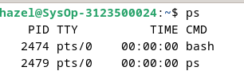
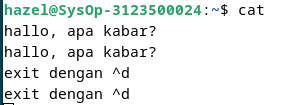
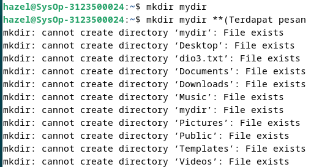
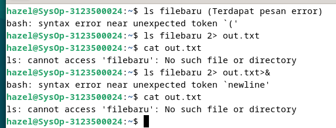
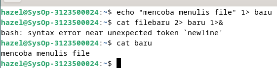
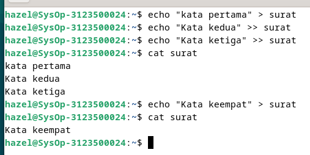
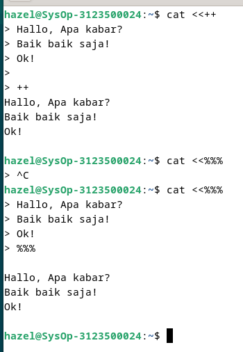
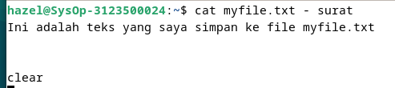

<div align="center">
  <h1 style="font-weight: bold">Pratikum Operasi Input & Output Minggu 4</h1>
  <h4 style="text-align: center;">Dosen Pengampu : Dr. Ferry Astika Saputra, S.T., M.Sc.</h4>
</div>
<br />
<br />
<div align="center">
  
  <h3 style="text-align: center;">Disusun Oleh : </h3>
  <p style="tex-align: center;">
    Wildan Krisna Hakim (3123500002)<br>
    Firsty Angelica Valency (3123500029)<br>
    Hazel Mangadaralam Pratama Rayes (3123500024)<br>
  </p>
  <h3 style="text-align: center;line-height: 1.5">Program Studi Teknik Informatika<br>Departemen Teknik Informatika Dan Komputer<br>Politeknik Elektronika Negeri Surabaya<br>2023/2024</h3>
  <hr>
</div>

## TUGAS PENDAHULUAN:

## Jawablah pertanyaan-pertanyaan di bawah ini :

1. Apa yang dimaksud redirection?
2. Apa yang dimaksud pipeline?
3. Apa yang dimaksud perintah di bawah ini :
   echo, cat, more, sort, grep, wc, cut, uniq

## Jawaban:

1. <b>Redirection (Pembelokan) :</b>
   Membelokkan strandar output suatu program ke file atau membelokkan standar input suatu program dari suatu file.

2. <b>Pipeline (Pipa):</b>
   Mekanisme pipa digunakan sebagai alat komunikasi antar proses.
   Input => Proses 1 => Output = Input => Proses 2 => Output
   Proses 1 menghasilkan output yang selanjutnya digunakan sebagai input oleh Proses 2. Hubungan output input ini dinamakan pipa, yang menghubungkan Proses 1 dengan Proses 2 dan dinyatakan dengan symbol "|".

```
   Proses1 | Proses
```

3. yang dimaksud perintah di bawah ini :
   <br><b>echo :</b> Menampilkan text
   <br><b>cat :</b> Melihat isi file
   <br><b>more :</b> Membuka file satu per satu
   <br><b>sort :</b> Digunakan untuk mengurutkan masukannya berdasarkan urutan nomor ASCII dari karakter
   <br><b>grep :</b> Digunakan untuk menyaring masukannya dan menampilkan baris-baris yang hanya mengandung pola yang ditentukan.
   <br><b>wc :</b> Digunakan untuk menghitung jumlah baris, kata dan karakter dari baris-baris masukan yang diberikan kepadanya. Untuk mengetahui berapa baris gunakan option -1. Untuk mengetahui berapa kata, gunakan option -w dan untuk mengetahui berapa karakter, gunakan option -c. Jika salah satu option tidak digunakan, maka tampilannya adalah jumlah baris, jumlah kata dan jumlah karakter .
   <br><b>cut :</b> Digunakan untuk mengambil kolom tertentu dan baris-baris masukannya, yang ditentukan pada opinion -c
   <br><b>uniq :</b> Digunakan untuk menghilangkan baris-baris berurutan yang mengalami duplikasi, biasanya digabungkan dalam pipeline dengan sort.

<br>

## PERCOBAAN:

1. Login sebagai user.
2. Bukalah Console Terminal dan lakukan percobaan-percobaan di bawah ini. Perhatikan hasil setiap percobaan.
3. Selesaikan soal-soal latihan.

## Percobaan 1 : File descriptor

1. Output ke layar (standar output), input dari system (kernel)

   ```
   $ ps
   ```

   

2. Output ke layar (standar output), input dari keyboard (standard input)

   ```
    $ cat
    hallo, apa kabar
    hallo, apa kabar
    exit dengan ^d
    exit dengan ^d
    [Ctrl-d]
   ```

   

3. Input nama direktori, output tidak ada (membuat direktori baru), bila terjadi error maka tampilan error pada layar (standard error)

   ```
   $ mkdir mydir
   $ mkdir mydir **(Terdapat pesan error)**

   ```

    

## Percobaan 2 : Pembelokan (redirection)

1. Pembelokan standar output

   ```
    $ cat 1> myfile.txt
    Ini adalah teks yang saya simpan ke file myfile.txt
   ```

   

2. Pembelokan standar input, yaitu input dibelokkan dari keyboard menjadi dari file

   ```
    $ cat 0< myfile.txt
    $ cat myfile.txt
   ```

   

3. Pembelokan standar error untuk disimpan di file

   ```
    $ mkdir mydir (Terdapat pesan error)
    $ mkdir mydir 2> myerror.txt
    $ cat myerror.txt
   ```

   

4. Notasi 2>&1 : pembelokan standar error (2>) adalah identik dengan file descriptor 1.

   ```
    $ ls filebaru (Terdapat pesan error)
    $ ls filebaru 2> out.txt
    $ cat out.txt
    $ ls filebaru 2> out.txt 2>&
    $ cat out.txt
   ```

    

5. Notasi 1>&2 (atau >&2) : pembelokan standar output adalah sama dengan file descriptor 2 yaitu standar error

   ```
   $ echo “mencoba menulis file” 1> baru
   $ cat filebaru 2> baru 1>&
   $ cat baru
   ```

   

6. Notasi >> (append)
   ```
   $ echo “kata pertama” > surat
   $ echo “kata kedua” >> surat
   $ echo “kata ketiga” >> surat
   $ cat surat
   $ echo “kata keempat” > surat
   $ cat surat
   ```
    

7. Notasi here document (<<++ .... ++) digunakan sebagai pembatas input dari keyboard. Perhatikan bahwa tanda pembatas dapat digantikan dengan tanda apa saja, namun harus sama dan tanda penutup harus diberikan pada awal baris
   ```
   $ cat <<++
   Hallo, apa kabar?
   Baik-baik saja?
   Ok!
   ++
   $ cat <<%%%
   Hallo, apa kabar?
   Baik-baik saja?
   Ok!
   %%%
   ```
   

 8. Notasi – (input keyboard) adalah representan input dari keyboard. Artinya menampilkan file 1, kemudian menampilkan input dari keyboard dan menampilkan file 2. Perhatikan bahwa notasi “-“ berarti menyelipkan input dari keyboard
    ```
    $ cat myfile.txt – surat
    ```  
    

## Percobaan 3 : Pipa (pipeline)
