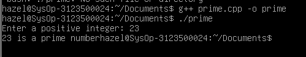
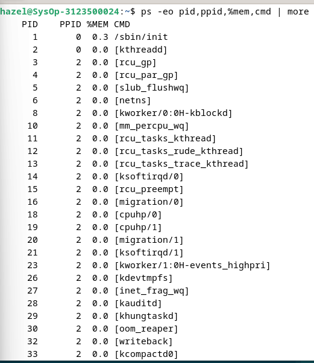
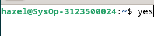

  <h1 style="font-weight: bold">Proses dan Manajemen Proses
Sistem Operasi Minggu 5</h1>
  <h4 style="text-align: center;">Dosen Pengampu : Dr. Ferry Astika Saputra, S.T., M.Sc.</h4>

 
 

  
  <h3 style="text-align: center;">Disusun Oleh : </h3>
  

    Hazel Mangadaralam Pratama Rayes (3123500024) 
  

  <h3 style="text-align: center;line-height: 1.5">Program Studi Teknik Informatika Departemen Teknik Informatika Dan Komputer Politeknik Elektronika Negeri Surabaya 2023/2024</h3>
  

## Daftar isi

1. [Jawaban Tugas Pendahuluan](#tugas-pendahuluan)
2. [Laporan Hasil Percobaan](#percobaan)

# Tugas Pendahuluan
Jawablah pertanyaan-pertanyaan di bawah ini :
1.	Apa yang dimaksud dengan proses ? 
Jawab: Program yang sedang diekssekusi atau dijalankan oleh CPU 

2.	Apa yang dimaksud perintah untuk menampilkan status proses :
ps, pstree. 
Jawab: perintah ps menampilkan proses di linux yang berupa: 
* PID: nomor identifikasi proses.

* TTY: Nama konsol tempat pengguna masuk.

* WAKTU: Jumlah waktu CPU yang digunakan proses.

* CMD: nama perintah yang memulai proses

 Sedangkan pstree merupakan perintah untuk menampilkan pstree menampilkan struktur hierarki pohon dari semua proses yang berjalan. 

3.	Sebutkan opsi yang dapat diberikan pada perintah ps 
Jawab: Perintah menampilkan ps yaitu :
* -e : digunakan untuk melakukan semua proses
* -C : digunakan untuk menyaring proses berdasarkan nama / perintah
* -f : digunakan untuk menampilkan semua informasi secara lengkap.
* -r : digunakan untuk menampilkan proses yang sedang berjalan
* -u : digunakan untuk menampilkan proses pada user tertentu saja. Biasanya diikuti dengan menggunakan nama user yang ingin dilihat prosesnya
* -o : digunakan untuk menampilkan proses yang menggunakan kata kunci tertentu saja
* -aux dan -fae : melihat informasi proses secara keseluruhan
* -pid : digunakan untuk menampilkan informasi proses berdasarkan Process ID (PID)
* -ppid : menampilkan ID proses dari proses yang membuat proses yang sedang berjalan

4.	Apa yang dimaksud dengan sinyal ? Apa perintah untuk mengirim sinyal ?  
Jawab: Sinyal data atau informasi yang sudah mengalami beberapa proses sedemikian rupa hingga akhirnya menjadi sebuah informasi matang untuk dikirim ke pihak penerima. Proses dapat mengirim dan menerima sinyal dari dan ke proses lainnya. Proses mengirim sinyal melalui instruksi “kill” dengan format
kill [-nomor sinyal] PID

5.	Apa yang dimaksud dengan proses foreground dan background pada job control ? 
Jawab: 
* forehand: mengontrol shell - menerima input dari keyboard dan mengirim output ke layar
* Background: tidak menerima input dari terminal, biasanya berjalan tanpa memerlukan interaksi

6.	Apa yang dimaksud perintah-perintah penjadwalan prioritas :  
top, nice, renice.  
Jawab: 
* top: menampilkan daftar proses yang sedang berjalan secara real-time beserta informasi terkait penggunaan sumber daya seperti CPU, memori, dan lainnya
* nice : melihat proses mana yang memakan sumber daya yang paling banyak, sehingga dapat membantu dalam mengidentifikasi proses-proses yang membutuhkan perhatian khusus dengan memberikan nilai (biasanya dari -20 hingga 19) yang menentukan prioritas proses tersebut. Semakin rendah nilai yang diberikan, semakin tinggi prioritasnya.
* renice : digunakan untuk mengubah prioritas proses yang sedang berjalan 
dengan menyesuaikan prioritas proses yang sudah berjalan dengan memberikan nilai prioritas baru 
yang dilakukan setelah proses telah dimulai untuk memodifikasikan prioritasnya sesuai kebutuhan
 
## Percobaan

1. Login sebagai user.
2. Download program C++ untuk menampilkan bilangan prima yang bernama
   primes.

   
   
    
   
   

    
   Analisa : Program di atas menampilkan bilangan prima sampai ke N. Ketika dijalankan, program meminta input N dari pengguna dan menampilkan bilangan prima sampai mencapai bilangan N.
   
    

3. Lakukan percobaan-percobaan di bawah ini kemudian analisa hasil percobaan.
4. Selesaikan soal-soal latihan.

### Percobaan 1 : Status Proses

1. Pindah ke command line terminal (tty2) dengan menekan Ctrl+Alt+F2
   dan login ke terminal sebagai user

2. Instruksi `ps`

   
    
     
   Analisa :     Instruksi `ps` digunakan untuk melihat kondisi proses yang ada 

     

3. Instruksi `ps -u`

   

    
   Analisa :     Instruksi `ps -u` (user), digunakan untuk melihat elemen/faktor lain dari kondisi proses yang ada serta menampilkan nama user

    

4. Instruksi `ps -u <user>`

   

    
   Analisa :     Mencari proses yang spesifik pemakai. Proses diatas hanya terbatas pada proses milik pemakai. Perintah tersebut digunakan untuk menampilkan proses pada user yang kita inginkan.

5. Instruksi `ps -a`

   

    
   Analisa :     Perintah tersebut digunakan untuk menampilkan daftar dari semua proses yang sedang berjalan

6. Instruksi `ps -au`

    

    
   Analisa :    Perintah ps -au digunakan untuk menampilkan informasi yang lebih rinci tentang semua proses yang sedang berjalan, termasuk proses yang dimiliki oleh pengguna (termasuk proses terminal yang sedang dijalankan) dan proses sistem.

### Percobaan 2 : Menampilkan Hubungan Proses Parent dan Child

1. Instruksi `ps -eH`

   

    
   Analisa :     Perintah tersebut digunakan untuk menampilkan seluruh proses secara hierarki. Dimana opsi *e* digunakan untuk memilih semua proses dan opsi *H* untuk menghasilkan tampilan proses secara hierarki. 

    
     

2. Perintah `ps -e f`

    

    
   Analisa :     Menghasilkan tampilan serupa dengan langkah 2. Opsi *f* disini berfungsi untuk menampilkan STAT dari sebuah proses dan menampilkan status proses dengan karakter grafis ( \ dan _ ) 

    

3. Perintah ` pstree`

    

     
   Analisa :     Gambar diatas tampak seperti pohon atau diagram. Perintah tersebut berfungsi untuk menampilkan struktur proses yang berjalan di sistem secara hirarkis parent/child.

    

4. Perintah `pstree | grep mingetty`

    

     
   Analisa :     Perintah ini berfungsi untuk menampilkan semua proses mingetty yang berjalan pada sistem yang berupa console virtual. Pada gambar diatas tidak ada output yang keluar dikarenakan tidak ada proses mingetty yang sedang berjalan

    

5. Perintah `pstree –h`

   

    
   Analisa :     Dalam sistem Linux, perintah `pstree -h` digunakan untuk menampilkan struktur proses dalam bentuk pohon dengan opsi "human-readable" yang menyederhanakan ukuran angka yang besar ke format yang lebih mudah dipahami manusia.

    

### Percobaan 3 : Menampilkan Status Proses dengan Berbagai Format

1. Perintah ` ps –e | more`

   

    
   Analisa :     Perintah `ps -e | more` berfungsi untuk menampilkan daftar semua proses yang sedang berjalan di sistem secara berurutan, dan outputnya akan ditampilkan secara bertahap menggunakan perintah `more`

    

2. Perintah `ps ax | more`

   

    
   Analisa :     Opsi a akan menampilkan semua proses yang dihasilkan terminal (TTY). Opsi x menampilkan semua proses yang tidak dihasilkan terminal. Yang kemudian outputnya ditampilkan secara bertahap menggunakan perintah `more`

    

3. Perintah `ps ef | more`

    

    
   Analisa :     Ketika perintah `ps – ef | more` dieksekusi maka opsi *-ef* akan menampilkan semua proses dalam format daftar penuh. Yang kemudian outputnya ditampilkan secara bertahap menggunakan perintah `more`

    

4. Perintah `ps –eo pid,cmd | more`

     

    
   Analisa :     Opsi `–eo` akan menampilkan semua proses dalam format sesuai definisi user yaitu terdiri dari kolom PID dan CMD. Yang kemudian outputnya akan ditampilkan secara bertahap menggunakan perintah `more`

    

5. Perintah `ps –eo pid,ppid,%mem,cmd | more`

   

    
   Analisa :     Perintah `ps -eo pid,ppid,%mem,cmd | more` akan menampilkan kolom PID, PPID dan %MEM. Dimana PPID adalah proses ID dari proses parent. %MEM menampilkan persentasi memory system yang digunakan proses. Jika proses hanya menggunakan sedikit memory system akan ditampilkan 0.

    

### Percobaan 4 : Mengontrol proses pada shell

1. Perintah `yes`

   
    
   

    
   Analisa :     Perintah `yes` akan memberikan output huruf y yang tidak pernah berhenti. Untuk menghentikannya harus menggunakan *Ctrl + C*

    

2. Perintah `yes > /dev/null`

    

     
   Analisa :     Membelokkan standard output dari perintah `yes` ke `/dev/null`. Untuk menghentikannya harus menggunakan *Ctrl + C*.

    

3. Perintah ` yes > /dev/null &`

   

    
   Analisa :     Salah satu cara agar perintah `yes` tetap dijalankan tetapi shell tetap digunakan untuk hal yang lain dengan meletakkan proses pada background dengan menambahkan karakter `&` pada akhir perintah. `[1]` merupakan job number PID.

    

4. Perintah `jobs`

    

    
   Analisa :     Perintah di atas digunakan untuk melihat status proses yang telah digunakan.

    
5. Perintah `kill %(nomor job) contoh : kill %1`

    

    
   Analisa :     Perintah `kill` digunakan untuk menghentikan job diikuti oleh *job number* atau PID Proses. Untuk identifikasi job number, penulisan perintah diikuti prefix dengan karakter `%`.

      
6. Perintah `jobs`
    
    

    
   Analisa :     Ini adalah tahap terakhir, yaitu menggunakan perintah `jobs` untuk melihat status job setelah diterminasi.

      

