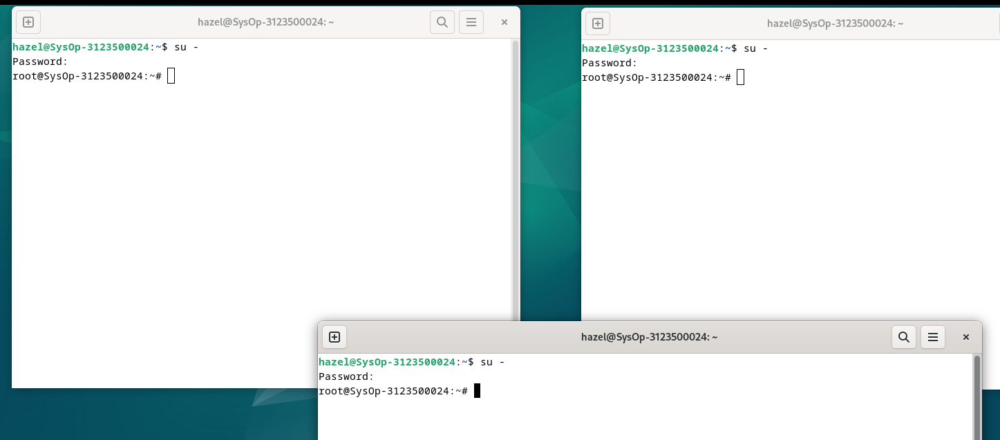

  <h1 style="font-weight: bold">Proses dan Manajemen Proses
Sistem Operasi Minggu 6</h1>
  <h4 style="text-align: center;">Dosen Pengampu : Dr. Ferry Astika Saputra, S.T., M.Sc.</h4>

 
 

  
  <h3 style="text-align: center;">Disusun Oleh : </h3>
  

    Hazel Mangadaralam Pratama Rayes (3123500024) 
  

  <h3 style="text-align: center;line-height: 1.5">Program Studi Teknik Informatika Departemen Teknik Informatika Dan Komputer Politeknik Elektronika Negeri Surabaya 2023/2024</h3>
  

## Daftar isi

1. [Jawaban Tugas Pendahuluan](#tugas-pendahuluan)
2. [Laporan Hasil Percobaan](#percobaan)

### Percobaan 5 : Menghentikan dan Memulai Kembali Job

1. Perintah `yes > /dev/null`

    

    
   Analisa :

    

2. Perintah `fg`

    

    
   Analisa :

    

3. Perintah `bg`

    

    
   Analisa :

    

4. Perintah `yes &`

    

    
   Analisa :

    

5. Perintah `fg %2, bg %2 atau %2`

    

    
   Analisa :

    

6. Perintah `fg`

    

    
   Analisa :

    

7. Perintah `ps -fae`

    

    
   Analisa :

    

### Percobaan 6 : Percobaan dengan Penjadwalan Prioritas

1. Login sebagai root

2. Buka tiga terminal,tampilkan pada screen yang sama

   

    

3. Pada setiap terminal, ketik `PS1 = ” \w:”` diikuti Enter. `\w` menampilkan path pada direktori home.

   
 
     
4. Karena login sebagai root, maka akan ditampilkan `~:` pada setiap terminal. Untuk setiap terminal ketik `pwd` dan tekan Enter untuk melihat bahwa Anda sedang berada pada direktori `/root`.

    
  
   
5. Buka terminal lagi (keempat), atur posisi sehingga keempat terminal terlihat pada screen

   
  
   

6. Pada terminal keempat, ketik `top` dan tekan *Enter*. Maka program `top` akan muncul. Ketik `i`. Top akan menampilkan proses yang aktif. Ketik `lmt`. `Top` tidak lagi menampilkan informasi pada bagian atas dari screen. Pada percobaan ini, terminal ke empat sebagai jendela `Top`.

