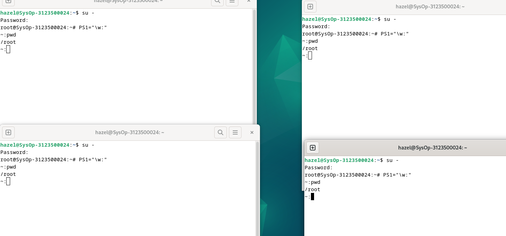

  <h1 style="font-weight: bold">Proses dan Manajemen Proses
Sistem Operasi Minggu 6</h1>
  <h4 style="text-align: center;">Dosen Pengampu : Dr. Ferry Astika Saputra, S.T., M.Sc.</h4>

 
 

  
  <h3 style="text-align: center;">Disusun Oleh : </h3>
  

    Hazel Mangadaralam Pratama Rayes (3123500024) 
  

  <h3 style="text-align: center;line-height: 1.5">Program Studi Teknik Informatika Departemen Teknik Informatika Dan Komputer Politeknik Elektronika Negeri Surabaya 2023/2024</h3>
  

## Daftar isi

1. [Jawaban Tugas Pendahuluan](#tugas-pendahuluan)
2. [Laporan Hasil Percobaan](#percobaan)

### Percobaan 5 : Menghentikan dan Memulai Kembali Job

1. Perintah `yes > /dev/null`

    

    
   Analisa : 
       Cara lain meletakkan job pada background dengan memulai job secara normal (pada foreground), stop job dan memulai lagi pada background. Gunakan perintah `yes > /dev/null` untuk memulai job baru. Hentikan sementara job (suspend), bukan menghentikannya (terminate), tetapi menghentikan sementara job sampai di restart. Untuk menghentikan sementara job gunakan *Ctrl + Z*

    

2. Perintah `fg`

    

    
   Analisa :
        Perintah `fg` disini digunakan untuk me-restart job pada *foreground*.

    

3. Perintah `bg`

    

    
   Analisa :     
   Setelah instruksi `fg`, Shell akan menampilkan nama perintah yang diletakkan di *foreground*. Stop job lagi dengan *Ctrl    + Z*. Kemudian gunakan perintah `bg` untuk meletakkan job pada *background*. 

    

4. Perintah `yes &`

    

    
   Analisa :
       Job pada *background* dapat digunakan untuk menampilkan teks pada terminal, dimana dapat diabaikan jika mencoba mengerjakan job lain seperti perintah di atas. Untuk menghentikannya tidak dapat menggunakan *Ctrl + C*. Job harus dipindah ke *foreground* baru diberhentikan dengan cara tekan `fg` dan tekan enter, Kemudian lanjutkan dengan *Ctrl + Z* untuk menghentikan sementara

    

5. Perintah `fg %2, bg %2 atau %2`

    

    
   Analisa :

   

  <h1 style="font-weight: bold">Proses dan Manajemen Proses
Sistem Operasi Minggu 6</h1>
  <h4 style="text-align: center;">Dosen Pengampu : Dr. Ferry Astika Saputra, S.T., M.Sc.</h4>

 
 

  
  <h3 style="text-align: center;">Disusun Oleh : </h3>
  

    Hazel Mangadaralam Pratama Rayes (3123500024) 
  

  <h3 style="text-align: center;line-height: 1.5">Program Studi Teknik Informatika Departemen Teknik Informatika Dan Komputer Politeknik Elektronika Negeri Surabaya 2023/2024</h3>
  

## Daftar isi

1. [Jawaban Tugas Pendahuluan](#tugas-pendahuluan)
2. [Laporan Hasil Percobaan](#percobaan)

### Percobaan 5 : Menghentikan dan Memulai Kembali Job

1. Perintah `yes > /dev/null`

    

    
   Analisa : 
       Cara lain meletakkan job pada background dengan memulai job secara normal (pada foreground), stop job dan memulai lagi pada background. Gunakan perintah `yes > /dev/null` untuk memulai job baru. Hentikan sementara job (suspend), bukan menghentikannya (terminate), tetapi menghentikan sementara job sampai di restart. Untuk menghentikan sementara job gunakan *Ctrl + Z*

    

2. Perintah `fg`

    

    
   Analisa :
        Perintah `fg` disini digunakan untuk me-restart job pada *foreground*.

    

3. Perintah `bg`

    

    
   Analisa :     
   Setelah instruksi `fg`, Shell akan menampilkan nama perintah yang diletakkan di *foreground*. Stop job lagi dengan *Ctrl    + Z*. Kemudian gunakan perintah `bg` untuk meletakkan job pada *background*. 

    

4. Perintah `yes &`

    

    
   Analisa :
       Job pada *background* dapat digunakan untuk menampilkan teks pada terminal, dimana dapat diabaikan jika mencoba mengerjakan job lain seperti perintah di atas. Untuk menghentikannya tidak dapat menggunakan *Ctrl + C*. Job harus dipindah ke *foreground* baru diberhentikan dengan cara tekan `fg` dan tekan enter, Kemudian lanjutkan dengan *Ctrl + Z* untuk menghentikan sementara

    

5. Perintah `fg %2, bg %2 atau %2`

    

    
   Analisa :
  Perintah di atas digumakan apabila ingin menjalankan banyak job dalam satu waktu, letakkan job pada *foreground* atau *background* dengan memberikan job ID. 

    

6. Perintah `fg`

    

    
   Analisa :
       tekan `fg` dan tekan *Enter*, kemudian dilanjutkan dengan *Ctrl-Z* untuk menghentikan sementara

    

7. Perintah `ps -fae`

    

    
   Analisa :
      Lihat job dengan perintah `ps -fae` dan tekan Enter. Kemudian hentikan proses dengan perintah kill. Pada proses di atas proses yang dihentikan adalah proses dengan PID 6142, yaitu proses `yes > /dev/null`

    

### Percobaan 6 : Percobaan dengan Penjadwalan Prioritas

1. Login sebagai root

2. Buka tiga terminal,tampilkan pada screen yang sama

   

    

3. Pada setiap terminal, ketik `PS1 = ” \w:”` diikuti Enter. `\w` menampilkan path pada direktori home.

   

     

4. Karena login sebagai root, maka akan ditampilkan `~:` pada setiap terminal. Untuk setiap terminal ketik `pwd` dan tekan Enter untuk melihat bahwa Anda sedang berada pada direktori `/root`.

   
5. Buka terminal lagi (keempat), atur posisi sehingga keempat terminal terlihat pada screen

   
  
   

6. Pada terminal keempat, ketik `top` dan tekan _Enter_. Maka program `top` akan muncul. Ketik `i`. Top akan menampilkan proses yang aktif. Ketik `lmt`. `Top` tidak lagi menampilkan informasi pada bagian atas dari screen. Pada percobaan ini, terminal ke empat sebagai jendela `Top`.

  

   
      
  
   
      

7. Pada terminal 1, bukalah program executable C++ dengan mengetik program `yes` dan tekan _enter_.
8. Ulangi langkah 7 untuk terminal 2

9. Jendela Top akan menampilkan dua program `yes` sebagai proses yang berjalan. Nilai `%CPU` sama pada keduanya. Hal ini berarti kedua proses mengkonsumsi waktu proses yang sama dan berjalan sama cepat. _PID_ dari kedua proses akan berbeda, misalnya pada contoh di atas adalah 2835 dan 2837. Kemudian gunakan terminal 3 (yang tidak menjalankan primes maupun Jendela Top) dan ketik _renice 19 2835_ dan diikuti Enter. Hal ini berarti mengganti penjadwalan prioritas dari proses ke 19.

 

10. Tunggu beberapa saat sampai program top berubah dan terlihat pada jendela `Top`. Pada kolom `STAT` memperlihatkan `N` untuk proses 2835. Hal ini berarti bahwa penjadwalan prioritas untuk proses 2835 lebih besar (lebih lambat) dari 0. Proses 2837 berjalan lebih cepat.

      

11. Program _top_ juga mempunyai fungsi yang sama dengan program `renice`. Pilih Jendela _Top_ dan tekan `r`. Program top terdapat prompt PID to renice: tekan 2835 dan tekan Enter. Program top memberikan prompt Renice PID 3148 to value: tekan -19 dan tekan Enter.

       
        
       
      

12. Tunggu beberapa saat sampai top berubah dan lihat nilai %CPU pada kedua proses. Sekarang proses 2835 lebih cepat dari proses 2837. Kolom status menunjukkan < pada proses 3148 yang menunjukkan penjadwalan prioritas lebih rendah (lebih cepat) dari nilai 0

       

13. Pilih terminal 3 (yang sedang tidak menjalankan yes atau program top) dan ketik nice –n -10 yes dan tekan Enter. Tunggu beberapa saat agar program top berubah dan akan terlihat proses primes ketiga. Misalnya PID nya 2845. Opsi -10 berada pada kolom NI (penjadwalan prioritas).

       

14. Jangan menggunakan mouse dan keyboard selama 10 detik. Program top menampilkan proses yang aktif selain program yes. Maka akan terlihat proses top terdaftar tetapi %CPU kecil (dibawah 1.0) dan konsisten. Juga terlihat proses berhubungan dengan dekstop grafis seperti X, panel dll.

       

15. Pindahkan mouse sehingga kursor berubah pada screen dan lihat apa yang terjadi dengan tampilan top. Proses tambahan akan muncul dan nilai %CPU berubah sebagai bagian grafis yang bekerja. Satu alasan adalah bahwa proses 2834 berjalan pada penjadwalan prioritas tinggi. Pilih jendela Top, ketik `r`. `PID to renice :` muncul prompt. Ketik 2834 dan tekan Enter. `Renice PID 2834 to value:` muncul prompt. Ketik 0 dan tekan Enter. Sekarang pindahkan mouse ke sekeliling screen. Lihat perubahannya

       

        
       
       
        
       

16. Tutup semua terminal window.

17. Logout dan login kembali sebagai user.

### Latihan : Cobalah format tampilan ps dengan opsi berikut dan perhatikan hasil tampilannya

1. Masuk ke tty2 dengan _Ctrl+Alt+F2_. Ketik `ps –au` dan tekan Enter. Kemudian perhatikan keluaran sebagai berikut :

      

   - Sebutkan nama-nama proses yang bukan root
   - Tulis PID dan COMMAND dari proses yang paling banyak menggunakan CPU time
   - Sebutkan buyut proses dan PID dari proses tersebut
   - Sebutkan beberapa proses daemon
   - Pada prompt login lakukan hal- hal sebagai berikut :
     `$ csh`
     `$ who`
     `$ bash`
     `$ ls`
     `$ sh`
     `$ ps`

      
      
      

   - Sebutkan PID yang paling besar dan kemudian buat urut-urutan proses sampai ke PPID = 1.

      

        1) PID = 2179 -> bash
        2) PID = 2712 -> sh
        3) PID = 2722 -> bash
        4) PID = 2730 -> sh
        5) PID = 2731 -> ps

2. Cobalah format tampilan ps dengan opsi berikut dan perhatikan hasil tampilannya :

   - `-f` daftar penuh

      

   - `-j` format job

       

   - `j` format job control

       

   - `l` daftar memanjang

       

   - `s` format sinyal

       

   - `v` format virtual memory

       

   - `X` format register i386

       

3. Lakukan urutan pekerjaan berikut :

   - Gunakan perintah `find` ke seluruh direktory pada sistem, belokkan output sehingga daftar direktori dialihkan ke file `directories.txt` dan daftar pesan error dialihkan ke file `errors.txt`

      

   - Gunakan perintah `sleep 5`. Apa yang terjadi dengan perintah ini ?

      

   - Jalankan perintah pada background menggunakan `&`

      

   - Jalankan `sleep 15` pada foreground, hentikan sementara dengan Ctrl-Z dan kemudian letakkan pada background dengan `bg`. Ketikkan `jobs`. Ketikkan `ps`. Kembalikan job ke foreground dengan perintah `fg`.

       

   - Jalankan `sleep 15` pada background menggunakan `&` dan kemudian gunakan perintah `kill` untuk menghentikan proses diikuti job number.

     

   - Jalankan `sleep 15` pada background menggunakan `&` dan kemudian gunakan `kill` untuk menghentikan sementara proses. Gunakan `bg` untuk melanjutkan menjalankan proses.

     

   - Jalankan `sleep 60` pada background 5 kali dan terminasi semua pada dengan menggunakan perintah `killall`.

      
      

   - Gunakan perintah `ps`, `w` dan `top` untuk menunjukkan semua proses yang sedang dieksekusi.

      
          
      

   - Gunakan perintah `ps –aeH` untuk menampilkan hierarki proses. Carilah init proses. Apakah Anda bisa identifikasi sistem daemon yang penting ? Dapatkan Anda identifikasi shell dan subproses ?

     

   - Kombinasikan `ps –fae` dan grep, apa yang Anda lihat ?

     

   - Jalankan proses `sleep 300` pada background. Log off komputer dan log in kembali. Lihat daftar semua proses yang berjalan. Apa yang terjadi pada proses sleep ?

     

  
  

    

6. Perintah `fg`

    

    
   Analisa :
       tekan `fg` dan tekan *Enter*, kemudian dilanjutkan dengan *Ctrl-Z* untuk menghentikan sementara

    

7. Perintah `ps -fae`

    

    
   Analisa :
      Lihat job dengan perintah `ps -fae` dan tekan Enter. Kemudian hentikan proses dengan perintah kill. Pada proses di atas proses yang dihentikan adalah proses dengan PID 6142, yaitu proses `yes > /dev/null`

    

### Percobaan 6 : Percobaan dengan Penjadwalan Prioritas

1. Login sebagai root

2. Buka tiga terminal,tampilkan pada screen yang sama

   

    

3. Pada setiap terminal, ketik `PS1 = ” \w:”` diikuti Enter. `\w` menampilkan path pada direktori home.

   

     

4. Karena login sebagai root, maka akan ditampilkan `~:` pada setiap terminal. Untuk setiap terminal ketik `pwd` dan tekan Enter untuk melihat bahwa Anda sedang berada pada direktori `/root`.

   
5. Buka terminal lagi (keempat), atur posisi sehingga keempat terminal terlihat pada screen

   
  
   

6. Pada terminal keempat, ketik `top` dan tekan _Enter_. Maka program `top` akan muncul. Ketik `i`. Top akan menampilkan proses yang aktif. Ketik `lmt`. `Top` tidak lagi menampilkan informasi pada bagian atas dari screen. Pada percobaan ini, terminal ke empat sebagai jendela `Top`.

  

   
      
  
   
      

7. Pada terminal 1, bukalah program executable C++ dengan mengetik program `yes` dan tekan _enter_.
8. Ulangi langkah 7 untuk terminal 2

9. Jendela Top akan menampilkan dua program `yes` sebagai proses yang berjalan. Nilai `%CPU` sama pada keduanya. Hal ini berarti kedua proses mengkonsumsi waktu proses yang sama dan berjalan sama cepat. _PID_ dari kedua proses akan berbeda, misalnya pada contoh di atas adalah 2835 dan 2837. Kemudian gunakan terminal 3 (yang tidak menjalankan primes maupun Jendela Top) dan ketik _renice 19 2835_ dan diikuti Enter. Hal ini berarti mengganti penjadwalan prioritas dari proses ke 19.

 

10. Tunggu beberapa saat sampai program top berubah dan terlihat pada jendela `Top`. Pada kolom `STAT` memperlihatkan `N` untuk proses 2835. Hal ini berarti bahwa penjadwalan prioritas untuk proses 2835 lebih besar (lebih lambat) dari 0. Proses 2837 berjalan lebih cepat.

      

11. Program _top_ juga mempunyai fungsi yang sama dengan program `renice`. Pilih Jendela _Top_ dan tekan `r`. Program top terdapat prompt PID to renice: tekan 2835 dan tekan Enter. Program top memberikan prompt Renice PID 3148 to value: tekan -19 dan tekan Enter.

       
        
       
      

12. Tunggu beberapa saat sampai top berubah dan lihat nilai %CPU pada kedua proses. Sekarang proses 2835 lebih cepat dari proses 2837. Kolom status menunjukkan < pada proses 3148 yang menunjukkan penjadwalan prioritas lebih rendah (lebih cepat) dari nilai 0

       

13. Pilih terminal 3 (yang sedang tidak menjalankan yes atau program top) dan ketik nice –n -10 yes dan tekan Enter. Tunggu beberapa saat agar program top berubah dan akan terlihat proses primes ketiga. Misalnya PID nya 2845. Opsi -10 berada pada kolom NI (penjadwalan prioritas).

       

14. Jangan menggunakan mouse dan keyboard selama 10 detik. Program top menampilkan proses yang aktif selain program yes. Maka akan terlihat proses top terdaftar tetapi %CPU kecil (dibawah 1.0) dan konsisten. Juga terlihat proses berhubungan dengan dekstop grafis seperti X, panel dll.

       

15. Pindahkan mouse sehingga kursor berubah pada screen dan lihat apa yang terjadi dengan tampilan top. Proses tambahan akan muncul dan nilai %CPU berubah sebagai bagian grafis yang bekerja. Satu alasan adalah bahwa proses 2834 berjalan pada penjadwalan prioritas tinggi. Pilih jendela Top, ketik `r`. `PID to renice :` muncul prompt. Ketik 2834 dan tekan Enter. `Renice PID 2834 to value:` muncul prompt. Ketik 0 dan tekan Enter. Sekarang pindahkan mouse ke sekeliling screen. Lihat perubahannya

       

        
       
       
        
       

16. Tutup semua terminal window.

17. Logout dan login kembali sebagai user.

### Latihan : Cobalah format tampilan ps dengan opsi berikut dan perhatikan hasil tampilannya

1. Masuk ke tty2 dengan _Ctrl+Alt+F2_. Ketik `ps –au` dan tekan Enter. Kemudian perhatikan keluaran sebagai berikut :

      

   - Sebutkan nama-nama proses yang bukan root
   - Tulis PID dan COMMAND dari proses yang paling banyak menggunakan CPU time
   - Sebutkan buyut proses dan PID dari proses tersebut
   - Sebutkan beberapa proses daemon
   - Pada prompt login lakukan hal- hal sebagai berikut :
     `$ csh`
     `$ who`
     `$ bash`
     `$ ls`
     `$ sh`
     `$ ps`

      
      
      

   - Sebutkan PID yang paling besar dan kemudian buat urut-urutan proses sampai ke PPID = 1.

      

        1) PID = 2179 -> bash
        2) PID = 2712 -> sh
        3) PID = 2722 -> bash
        4) PID = 2730 -> sh
        5) PID = 2731 -> ps

2. Cobalah format tampilan ps dengan opsi berikut dan perhatikan hasil tampilannya :

   - `-f` daftar penuh

      

   - `-j` format job

       

   - `j` format job control

       

   - `l` daftar memanjang

       

   - `s` format sinyal

       

   - `v` format virtual memory

       

   - `X` format register i386

       

3. Lakukan urutan pekerjaan berikut :

   - Gunakan perintah `find` ke seluruh direktory pada sistem, belokkan output sehingga daftar direktori dialihkan ke file `directories.txt` dan daftar pesan error dialihkan ke file `errors.txt`

      

   - Gunakan perintah `sleep 5`. Apa yang terjadi dengan perintah ini ?

      

   - Jalankan perintah pada background menggunakan `&`

      

   - Jalankan `sleep 15` pada foreground, hentikan sementara dengan Ctrl-Z dan kemudian letakkan pada background dengan `bg`. Ketikkan `jobs`. Ketikkan `ps`. Kembalikan job ke foreground dengan perintah `fg`.

       

   - Jalankan `sleep 15` pada background menggunakan `&` dan kemudian gunakan perintah `kill` untuk menghentikan proses diikuti job number.

     

   - Jalankan `sleep 15` pada background menggunakan `&` dan kemudian gunakan `kill` untuk menghentikan sementara proses. Gunakan `bg` untuk melanjutkan menjalankan proses.

     

   - Jalankan `sleep 60` pada background 5 kali dan terminasi semua pada dengan menggunakan perintah `killall`.

      
      

   - Gunakan perintah `ps`, `w` dan `top` untuk menunjukkan semua proses yang sedang dieksekusi.

      
          
      

   - Gunakan perintah `ps –aeH` untuk menampilkan hierarki proses. Carilah init proses. Apakah Anda bisa identifikasi sistem daemon yang penting ? Dapatkan Anda identifikasi shell dan subproses ?

     

   - Kombinasikan `ps –fae` dan grep, apa yang Anda lihat ?

     

   - Jalankan proses `sleep 300` pada background. Log off komputer dan log in kembali. Lihat daftar semua proses yang berjalan. Apa yang terjadi pada proses sleep ?

     

# Kesimpulan

Proses merupakan program yang sedang dieksekusi oleh CPU dimana statusnya kita bisa melihat dengan berbagai macam perintah. Dalam linuk kita bisa menggunakan banyak terminal yang penggunaannya kita bisa melihat di perintah ps atau top misalnya. Bahkan ada skala prioritas yang diatur oleh Linux dimana proses tersebut dapat dijalankan terlebih dahulu dan apabila dirasa tidak dibutuhkan bisa melakukan penghentian proses dengan perintah kill diikuti oleh PID dari proses. Proses yang berjalan pada background apabila dilakukan logout status prosesnya masih dijalankan oleh OS.

     

