<div align="center">
  <h1 class="text-align: center;font-weight: bold">Ujian Tengah Semester 2<br>Praktek System Operasi</h1>
  <h3 class="text-align: center;">Dosen Pengampu : Dr. Ferry Astika Saputra, S.T., M.Sc.</h3>
</div>
<br />
<div align="center">
  
  <div align="center">
  <h3 style="text-align: center;">Disusun Oleh :</h3>
  <p style="text-align: center;">
    Hazel Mangadaralam Pratama Rayes (3123500024)<br>
  </p>
</div>

<h3 style="text-align: center;line-height: 1.5">Politeknik Elektronika Negeri Surabaya<br>Departemen Teknik Informatika Dan Komputer<br>Program Studi Teknik Informatika<br>2023/2024</h3>
  <hr><hr>
</div>

# Process - Fork - Multithread

Setiap program atau bagian dari program yang sedang dieksekusi oleh CPU disebut dengan proses. Proses dapat berjalan secara _foreground_ atau _background_.

Untuk melihat seluruh proses yang sedang berjalan gunakan perintah `$ ps -e` .
Bisa juga menggunakan perintah `$pstree | more` untuk melihat secara detil proses yang sefan berjalan dengan format **tree**.

Setiap proses akan memilik **PID** Process ID). Apabila dibutuhkan Sebuah proses bisa memiliki proses anakan. Dalam hubungan tersebut proses dapat diibaratkan seperti orang tua (_parent_) dengan anak (_child_) yang turun temurun.

- Setiap proses memiliki parent dan child.
- Setiap proses memiliki ID (_pid_) dan parent ID (_ppid_), kecuali proses `init` atau `systemd`.
- _ppid_ dari sebuah proses adalah ID dari parent proses tersebut.

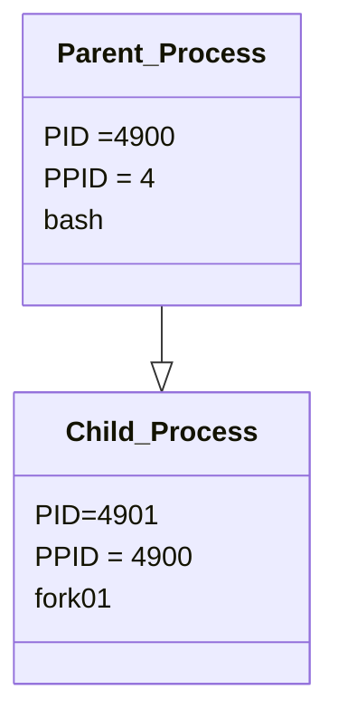

Perhatikan, ppid dari proses `fork01` adalah pid dari proses `bash`.

**fork** digunakan untuk menduplikasi proses. Proses yang baru disebut dengan child proses, sedangkan proses pemanggil disebut dengan parent proses. Spesifikasi fork bisa dilihat dengan `$ man 2 fork`.

```
int main() {
                            pid: 2308, ppid: 10
                             [Main process]
                                 |
  fork();              > Child process created <
                                 +
                               /   \
                             /       \
               pid: 2308, ppid: 10    pid: 30, ppid: 2308
                [Parent Process]    [Child Process]

  return 0;
}
```

perhatikan bahwa :

- `pid` Parent Process == `ppid` Child
- `child_id` Parent Process == `pid` Child Process

**Exec** adalah function yang digunakan untuk menjalankan program baru dan mengganti program yang sedang berlangsung. `exec` adalah program family yang memiliki berbagai fungsi variasi, yaitu `execvp`, `execlp`, `execv`, dan lain lain.

**wait** adalah function yang digunakan untuk mendapatkan informasi ketika child proses berganti _state_-nya. Pergantian state dapat berupa _termination_, _resume_, atau _stop_.

Manual: `$ man 3 exec`

## 1. Fork : Parent - Child Process

- Buat tulisan tentang konsep **fork** dan implementasinya dengan menggunakan bahasa pemrograman C! (minimal 2 paragraf disertai dengan gambar)

---

<h3 style="text-align: center; font-weight: semi-bold; margin-top: 0; margin-bottom: 0; text-decoration: underline">Konsep Fork</h3>
<br><br>

<p align="justify">
  Fork() dalam sistem operasi Linux atau Unix merupakan sebuah proses baru untuk menduplikasi proses pemanggilan. Proses baru ini biasa disebut dengan proses anak / menganak / melahirkan, proses pemanggilanya dapat dikatakan sebagai Proses induk (parent) sedangkan proses yang diduplikasikan (child),
  proses child yang dihasilkan merupakan hasil replika proses parent pada saat fork di Panggil, hal ini meliput kode program , nilai variabel dan ruang alamat pada memori, fork sangat berguna untuk aplikasi multi-threading dan pemrosesan secara pararel. kalau didalam bahasa pemrograman C, fungsi fork() di terapkan untuk memanfaatkan mekanisme ini, Fungsi ini, ketika dipanggil,meminta sistem operasi untuk membuat proses baru. dan proses baru ini atau child akan memulai eksekusinya dari titik yang sama dimana fork() di inisialisasi.
  tetapi bisa diidentifikasi dengan nilai pengembalian yang unik yaitu PID positif di parent untuk mengidentifikasi proses child, dan nilai 0 dalam proses child, memungkinkan keuda proses tersebut untuk mengeksekusi logika kondisional yang berbeda berdasarkan identitas.

Contoh Parent Proses (pstree)

<p align="center">
  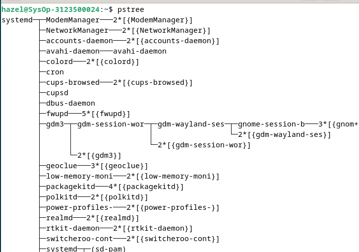
</p>

<br><br>

Penggunaan Fork() dalam bahasa C, pemrogram harus memperhatikan pengelolaan proses child dan parent secara seksama untuk menghindari kondisi seperti zombie, proses zombie dimana sebuah anak (child) telah menyelesaikan eksekusinya namun induk belum mematikan proses child tersebut, maka dari itu pemrogram harus menggunakan waitid() hal tersebut diperuntukan agar si child tidak menjadi Zombie, waitid() akan menghalangi parent berakhir sebelum child dan memungkinkan Sistem operasi untuk menghentikan semua sumber daya yang digunakan oleh child.

<p align="center">
  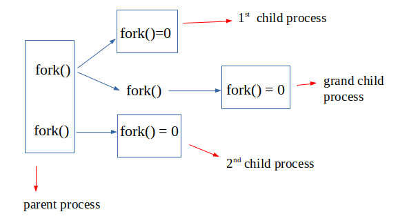
</p>

Contoh program fork() :

<p align="center">
  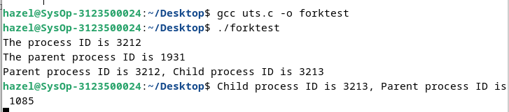
</p>

</p>

---

- Akses dan clonning repo : https://github.com/ferryastika/operatingsystem.git

1. Kunjungi Git yang akan di Clone dan cari bagian https
   codenya
2. Simpan di files,buka di terminal lalu gunakan perintah cd

   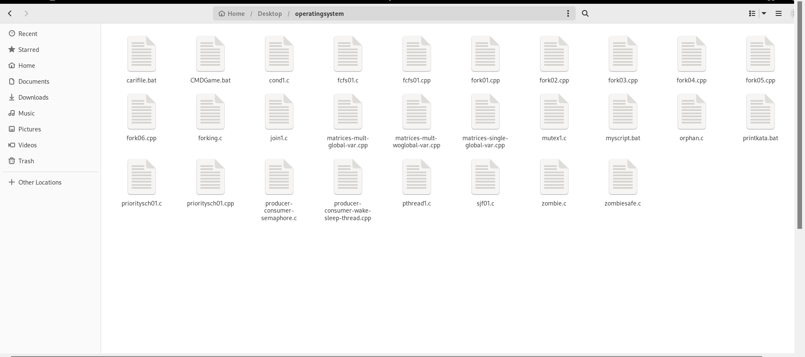

   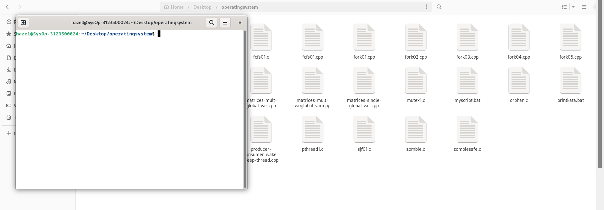

---

- Deskripsikan dan visualisasikan pohon proses hasil eksekusi dari kode program `fork01.c`, `fork02.c`, `fork03.c`, `fork04.c`, `fork05.c`dan `fork06.c`.

---

`fork01.c`

   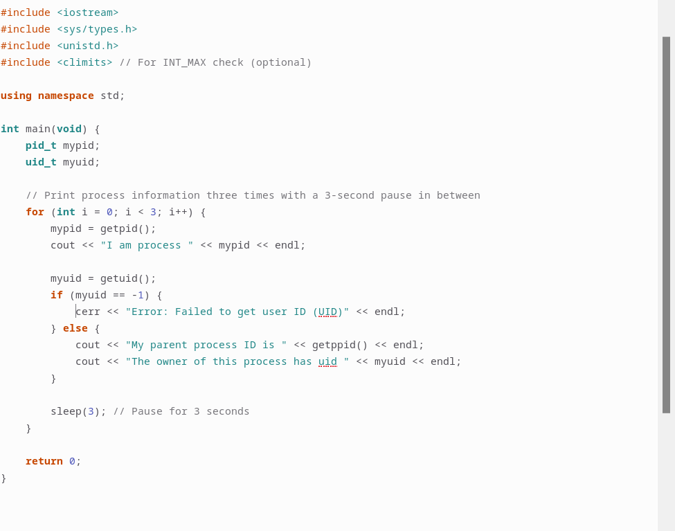
   
   <br>

`Output`

   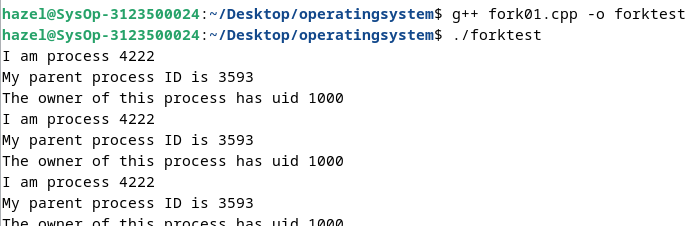
    
<br>

Deskripsi : `fork01.cpp` adalah program sederhana yang mencetak informasi tentang proses saat ini, seperti ID proses (PID), ID proses induk (PPID), dan ID pengguna (UID). Program ini kemudian akan tidur selama 3 detik sebelum mencetak informasi tersebut lagi.

i. Awalnya, ada satu proses yang dibuat oleh sistem operasi. Proses ini adalah proses utama atau proses "induk" dari semua proses lainnya.

ii. Proses utama memulai eksekusi kode program. Setelah loop for dieksekusi, terdapat tiga iterasi dari loop tersebut.

iii. Pada setiap iterasi loop, proses utama melakukan panggilan sistem getpid() untuk mendapatkan PID-nya sendiri, kemudian mencetak informasi tentang dirinya sendiri, seperti PID, PPID, dan UID. Selanjutnya, proses utama akan tidur selama 3 detik.

iv. Pada setiap iterasi loop, sistem juga membuat salinan dari proses utama, yang disebut child process. Child process memiliki ruang alamat yang sama dengan proses utama, tetapi memiliki PID yang berbeda.

v. Setelah proses utama tidur selama 3 detik, ia akan terbangun dan mencetak informasi lagi. Hal yang sama juga terjadi dengan child process.

vi. Proses utama dan child process melakukan hal yang sama pada setiap iterasi loop, tetapi karena mereka memiliki PID yang berbeda, mereka mencetak informasi yang berbeda pula.

Visualisasi Program :

```
                          Proses Program
                                 |
                                 |
                                 |
                            max 3x loop
                                 |
            CETAK & SLEEP 3 [PID : 4222, PPID : 3593, UID: 1000]

```

`fork02.c`

   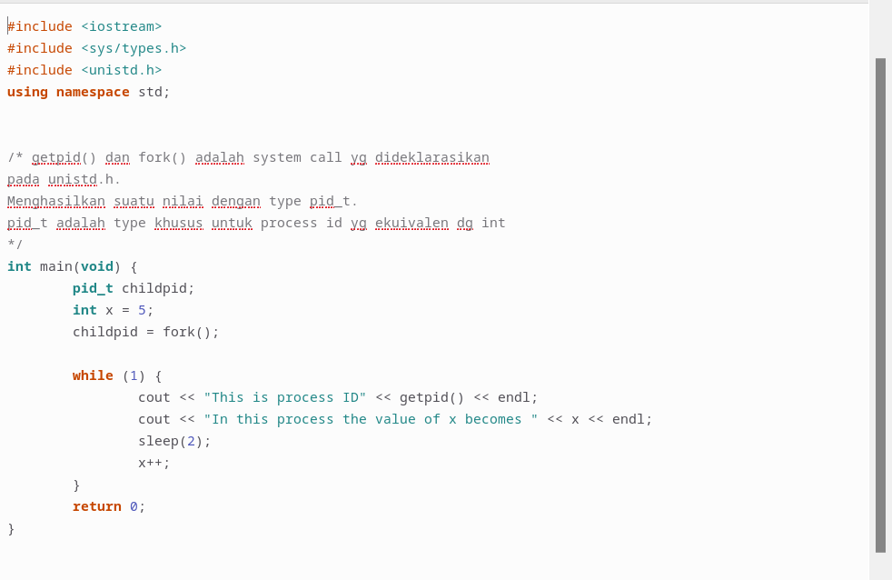

<br>

`output`

   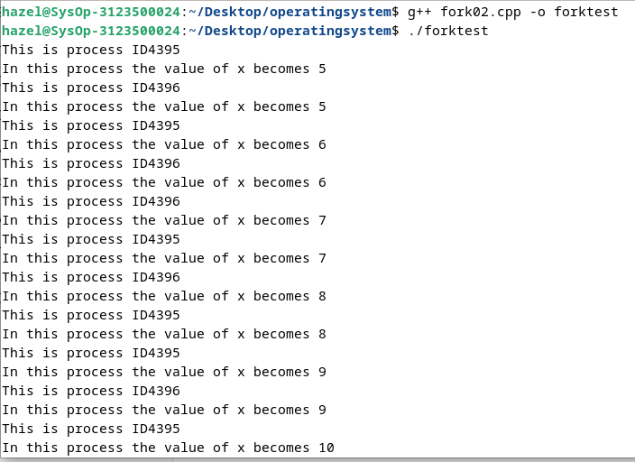

_1. Header Files:_

`<iostream> untuk operasi input dan output.`

`<sys/types.h> untuk menyediakan definisi berbagai tipe data yang berkaitan dengan OS.`

`<unistd.h> untuk panggil sistem seperti getpid(),fork(),sleep()`

_2. Deklarasi using namespace :_

`untuk menggunakan semua elemen dari std`

_3. Fungsi main_

`awal permulaan masuk program`

_4.Deklarasi Variabel :_

```
ada berberapa variabel antara lain :
pid_t = untuk menyimpan ID proses
int x = 5 = mendeklarasi serta memberi value / nilai 5 pada variabel X
```

_5. Panggilan Fungsi fork():_

```
childpid = fork(); untuk memanggil fork(),
serta membuat proses anak (child),
fork() akan mengembalikan nilai 0 menuju proses child
dan ID proses anak ke proses induk.
```

_6. Loop while :_

```
- Loop ini akan berjalan tanpa henti
- mencetak ID proses saat itu langsung dengan getpid()
- Mencetak nilai dari variabel X
- Menunda eksekusi dengan sleep 2 yaitu nunda 2 detik
- menginkeremen / menambahkan var X
```

Visualisasi program :

```
                               Parent Process
                                      |
                                  fork()
                 [loop getpid(), inkeremen x, sleep 2 detik]
                                      |
                                Child Process


```

`fork3.cpp`

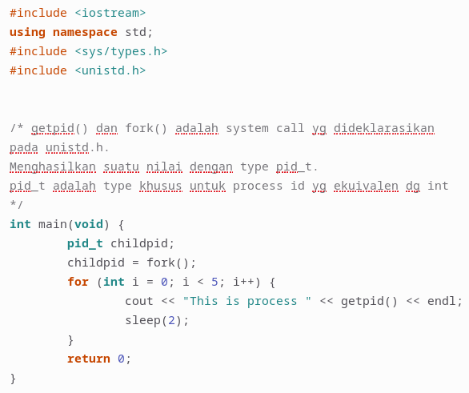

`output`


Deskripsi : fork03.cpp adalah program sederhana yang menggunakan fungsi fork() untuk membuat child process, kemudian mencetak PID dari proses (baik parent maupun child) dalam sebuah loop. Setiap proses akan mencetak PID-nya sendiri beberapa kali sebelum program selesai dieksekusi.

i. Awalnya, ada satu proses yang dibuat oleh sistem operasi. Proses ini adalah proses utama atau proses "induk" dari semua proses lainnya.

ii. Proses utama memulai eksekusi kode program. Kemudian, di dalam program, terdapat pemanggilan fungsi fork(). Pemanggilan ini menyebabkan pembuatan salinan dari proses utama yang disebut child process.

iii. Setelah fork(), terdapat dua proses yang berjalan secara paralel: proses utama dan child process. Kedua proses ini memiliki ruang alamat yang sama dengan proses utama, tetapi memiliki PID yang berbeda.

iv. Setiap proses (baik parent maupun child) akan memasuki loop for yang akan mencetak PID-nya sendiri beberapa kali.

v. Karena loop memiliki batasan iterasi sebanyak lima kali, masing-masing proses akan mencetak PID-nya sendiri lima kali.

---

Visualisasi program

```

Mulai
 │
 ├─> Proses Induk
 │    │
 │    ├─ fork() ───> Gagal (-1)? ──> Keluar
 │    │
 │    └─> Sukses
 │         │
 │         ├─> Proses Anak (childpid = 0)
 │         │    │
 │         │    ├─ Loop 5 kali:
 │         │    │   ├─ Cetak "This is process [ID Proses Anak]"
 │         │    │   └─ Tidur 2 detik
 │         │    └─> Keluar
 │         │
 │         └─> Proses Induk (childpid = [ID Proses Anak])
 │              │
 │              ├─ Loop 5 kali:
 │              │   ├─ Cetak "This is process [ID Proses Induk]"
 │              │   └─ Tidur 2 detik
 │              └─> Keluar
 └─> Keluar
```

<br>

`fork04.cpp`

```
Fork04.cpp :
#include <iostream>
using namespace std;
#include <sys/types.h>
#include <unistd.h>
#include <sys/wait.h>
/* pid_t fork() dideklarasikan pada unistd.h.
pid_t adalah type khusus untuk process id yg ekuivalen dg int
*/

int main(void) {
	pid_t child_pid;
	int status;
	pid_t wait_result;
	child_pid = fork();
	if (child_pid == 0) {
		/* kode ini hanya dieksekusi proses child */
		cout << "I am a child and my pid = " << getpid() << endl;
		cout << "My parent is " << getppid() << endl;
		/* keluar if akan menghentikan hanya proses child */
	}
    else if (child_pid > 0) {
		/* kode ini hanya mengeksekusi proses parent */
		cout << "I am the parent and my pid = " << getpid() << endl;
		cout << "My child has pid = " << child_pid << endl;
	}
	else {
		cout << "The fork system call failed to create a new process" << endl;
		exit(1);
	}
		/* kode ini dieksekusi baik oleh proses parent dan child */
		cout << "I am a happy, healthy process and my pid = " << getpid() << endl;
		if (child_pid == 0) {
		/* kode ini hanya dieksekusi oleh proses child */
		cout << "I am a child and I am quitting work now!"<< endl;
	}
	else {
		/* kode ini hanya dieksekusi oleh proses parent */
		cout << "I am a parent and I am going to wait for my child" << endl;
	do {
		/* parent menunggu sinyal SIGCHLD mengirim tanda bahwa proses child diterminasi */
		wait_result = wait(&status);
	} while (wait_result != child_pid);
		cout << "I am a parent and I am quitting." << endl;
	}
	return 0;
}
```

`output`

   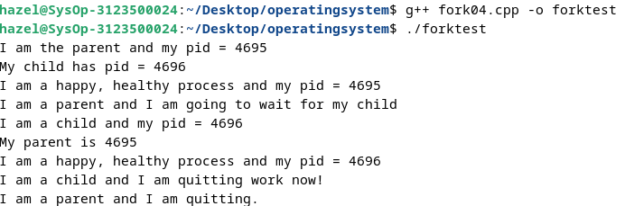

_1. Header Files:_

`<iostream> untuk operasi input dan output.`

`<sys/types.h> untuk menyediakan definisi berbagai tipe data yang berkaitan dengan OS.`

`<unistd.h> untuk panggil sistem seperti getpid(), fork()`

`<sys/wait.h> untuk panggil sistem seperti wait()`

_2. Deklarasi using namespace :_

`untuk menggunakan semua elemen dari std`

_3. Fungsi main_

`awal permulaan masuk program`

_4.Deklarasi Variabel :_

```
ada berberapa variabel antara lain :
pid_t = childpid = untuk menyimpan ID proses anak dari panggilan fork()
int = status = untuk menyimpan status keluar dari proses child.
pid_t = wait_result = untuk menyimpan hasil dari pemanggilan wait(),

```

_5. Panggilan fork()_

```
membuat proses anak / child
```

_6.Percabangan (if else) :_

```
pada proses anak (child_pid == 0)
- mencetak id proses dan Id proses induk
- mencetak pesan sebelum keluar

pada proses induk (child_pid > 0)
- mencetak ID prosesnya dan ID proses anaknya
- Menunggu proses anak selesai dengan menggunakan fitur wait()
- wait(&status) untuk menunggu proses anak kelar dan menyimpannya
pada variabel status
- mencetak pesan sebelum keluar

kalau child_pid kurang dari 0 maka mencetak pesan error
```

Visualisasi program :

```
Mulai
 │
 ├─ fork()
 │  │
 │  ├─ Gagal (-1)
 │  │   └─ Cetak error ──> exit(1)
 │  │
 │  ├─ Proses Anak (0)
 │  │   ├─ Cetak "I am a child..." dan "My parent is..."
 │  │   ├─ Cetak "I am a happy, healthy process..."
 │  │   └─ Cetak "I am a child and I am quitting work now!" ──> Keluar
 │  │
 │  └─ Proses Induk (>0)
 │      ├─ Cetak "I am the parent..." dan "My child has pid..."
 │      ├─ Cetak "I am a happy, healthy process..."
 │      ├─ Cetak "I am a parent and I am going to wait for my child"
 │      ├─ wait() ──> Tunggu proses anak selesai
 │      └─ Cetak "I am a parent and I am quitting." ──> Keluar
 │
 └─> Keluar


```

`fork5.cpp`

```
#include <iostream>
using namespace std;
#include <sys/types.h>
#include <unistd.h>
#include <sys/wait.h>
/* pid_t fork() dideklarasikan pada unistd.h.
pid_t adalah type khusus untuk process id yg ekuivalen dg int
*/

int main(void) {
  pid_t child_pid;
  int status;
  pid_t wait_result;
  child_pid = fork();
  if (child_pid == 0) {
    /* kode ini hanya dieksekusi proses child */
    cout << "I am a child and my pid = " << getpid() << endl;
    execl("/bin/ls", "ls", "-l", "/home", NULL);
    /* jika execl berhasil kode ini tidak pernah digunakan */
    cout << "Could not execl file /bin/ls" << endl;
    exit(1);
    /* exit menghentikan hanya proses child */
   }
  else if (child_pid > 0) {
    /* kode ini hanya mengeksekusi proses parent */
   cout << "I am the parent and my pid = " << getpid() << endl;
   cout << "My child has pid = " << child_pid << endl;
  }
  else {
   cout << "The fork system call failed to create a new process" << endl;
   exit(1);
  }
  /* kode ini hanya dieksekusi oleh proses parent karena
  child mengeksekusi dari “/bin/ls” atau keluar */
   cout << "I am a happy, healthy process and my pid = " << getpid() << endl;
   if (child_pid == 0) {
  /* kode ini tidak pernah dieksekusi */
   printf("This code will never be executed!\n");
  }
  else {
   /* kode ini hanya dieksekusi oleh proses parent */
    cout << "I am a parent and I am going to wait for my child" << endl;
    do {
      /* parent menunggu sinyal SIGCHLD mengirim tanda bila proses child diterminasi */
      wait_result = wait(&status);
    } while (wait_result != child_pid);
    cout << "I am a parent and I am quitting." << endl;
  }
  return 0;
}
```

`output`

   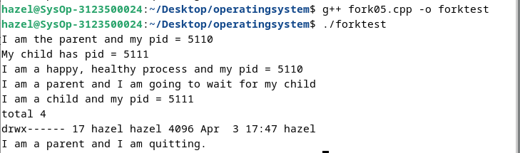

Deskripsi : `fork05.cpp` adalah contoh program yang menggunakan fungsi fork() untuk membuat proses child dan kemudian menggunakan fungsi execl() untuk menjalankan program ls pada direktori /home. Setelah menjalankan execl(), program akan keluar dari child process menggunakan fungsi exit().

i. Awalnya, ada satu proses yang dibuat oleh sistem operasi. Proses ini adalah proses utama atau proses "induk" dari semua proses lainnya.

ii. Proses utama memulai eksekusi kode program. Kemudian, di dalam program, terdapat pemanggilan fungsi fork(). Pemanggilan ini menyebabkan pembuatan salinan dari proses utama yang disebut child process.

iii. Setelah fork(), terdapat dua jalur eksekusi:

- Jalur eksekusi untuk proses child, di mana child process mencetak informasi tentang dirinya sendiri (PID) dan menjalankan program ls menggunakan fungsi execl(). Setelah itu, child process akan keluar menggunakan fungsi exit().

- Jalur eksekusi untuk proses parent, di mana parent process mencetak informasi tentang dirinya sendiri (PID) dan kemudian melanjutkan eksekusi program.

iv. Jika execl() berhasil dieksekusi, kode setelah execl() dalam proses child tidak akan pernah dieksekusi karena child process akan diganti oleh program ls yang baru dijalankan.

v. Program ls akan menampilkan daftar file dan direktori pada direktori /home.

vi. Setelah program ls selesai dieksekusi, child process akan keluar dari eksekusi menggunakan fungsi exit().

Visualisasi program :

```
Mulai
 │
 ├─ fork()
 │  │
 │  ├─ Gagal (-1)
 │  │   └─ Cetak error ──> exit(1)
 │  │
 │  ├─ Proses Anak (0)
 │  │   ├─ Cetak "I am a child..."
 │  │   ├─ execl("/bin/ls", "ls", "-l", "/home", NULL)
 │  │   │   └─ Gagal? ──> Cetak "Could not execl..." ──> exit(1)
 │  │   └─ (Proses digantikan oleh /bin/ls, tidak ada kode lebih lanjut yang dijalankan)
 │  │
 │  └─ Proses Induk (>0)
 │      ├─ Cetak "I am the parent..." dan "My child has pid..."
 │      ├─ Cetak "I am a happy, healthy process..."
 │      ├─ Cetak "I am a parent and I am going to wait for my child"
 │      ├─ wait(&status) ──> Tunggu proses anak selesai
 │      └─ Cetak "I am a parent and I am quitting." ──> Keluar
 │
 └─> Keluar


```

`fork6.cpp`

```

#include <iostream>
using namespace std;
#include <sys/types.h>
#include <unistd.h>
#include <sys/wait.h>
/* pid_t fork() dideklarasikan pada unistd.h.
pid_t adalah type khusus untuk process id yg ekuivalen dg int
*/

int main(void) {
	pid_t child_pid;
	int status;
	pid_t wait_result;
	child_pid = fork();


	if (child_pid == 0) {
		/* kode ini hanya dieksekusi proses child */
		cout << "I am a child and my pid = " << getpid() << endl;
		execl("./fork","fork03", "goose", NULL);
		/* jika execl berhasil kode ini tidak pernah digunakan */
		cout << "Could not execl file fork3" << endl;
		exit(1);
		/* exit menghentikan hanya proses child */
	}
	else if (child_pid > 0) {
		/* kode ini hanya mengeksekusi proses parent */
		cout << "I am the parent and my pid = " << getpid()<< endl;
		cout << "My child has pid = " << child_pid << endl;
	}
	else {
		cout << "The fork system call failed to create a new process" << endl;
		exit(1);
	}
	/* kode ini hanya dieksekusi oleh proses parent karena
	child mengeksekusi dari “fork3” atau keluar */
		cout << "I am a happy, healthy process and my pid = " << getpid() << endl;
		if (child_pid == 0) {
	/* kode ini tidak pernah dieksekusi */
		printf("This code will never be executed!\n");
	}
	else {
	/* kode ini hanya dieksekusi oleh proses parent */
		cout << "I am a parent and I am going to wait for my child" << endl;
		do {
		/* parent menunggu sinyal SIGCHLD mengirim tanda
		bila proses child diterminasi */
			wait_result = wait(&status);
		} while (wait_result != child_pid);
		cout << "I am a parent and I am quitting." << endl;
	}
	return 0;
}
```

`output`

   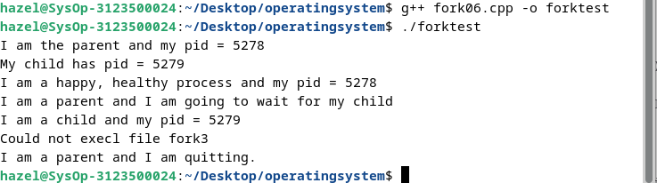

_1. Header Files:_

`<iostream> untuk operasi input dan output.`

`<sys/types.h> untuk menyediakan definisi berbagai tipe data yang berkaitan dengan OS.`

`<unistd.h> untuk panggil sistem seperti getpid(), fork()`

`<sys/wait.h> untuk panggil sistem seperti wait()`

_2. Deklarasi using namespace :_

`untuk menggunakan semua elemen dari std`

_3. Fungsi main_

`awal permulaan masuk program`

_4.Deklarasi Variabel :_

```
ada berberapa variabel antara lain :
pid_t = childpid = untuk menyimpan ID proses anak dari panggilan fork()
int = status = untuk menyimpan status keluar dari proses child.
pid_t = wait_result = untuk menyimpan hasil dari pemanggilan wait(),

```

_5. Panggilan fork()_

```
membuat proses anak / child
```

_6.Percabangan (if else) :_

```
pada proses anak (child_pid == 0)

- mencetak id anak
- mencoba menjalankan program ./fork03 menggunakan execl()
jika berhasil kode akan berjalan,
jika gagal maka akan mencetak "Could not execl file fork3"


pada proses induk (child_pid > 0)
- mencetak ID prosesnya dan ID proses anaknya
- Mencetak bahwa ini adalah proses .......
- wait(&status) untuk menunggu proses anak kelar Do while dipanggil untuk memastikan terus sampai proses anak selesai
- setelah proses anak selesai akan mencetak pesan keluar

kalau child_pid kurang dari 0 maka mencetak pesan error
```

Visualisasi program :

```
Mulai
 │
 ├─ fork()
 │  │
 │  ├─ Gagal (-1)
 │  │   └─ Cetak error ──> exit(1)
 │  │
 │  ├─ Proses Anak (0)
 │  │   ├─ Cetak "I am a child..."
 │  │   ├─ execl("fork03", "goose", NULL)
 │  │   │   └─ Gagal? ──> Cetak "Could not execl fork3" ──> exit(1)
 │  │   └─ (Proses digantikan oleh fork03, tidak ada kode lebih lanjut yang dijalankan)
 │  │
 │  └─ Proses Induk (>0)
 │      ├─ Cetak "I am the parent..." dan "My child has pid..."
 │      ├─ Cetak "I am a happy, healthy process..."
 │      ├─ Cetak "I am a parent and I am going to wait for my child"
 │      ├─ Menunggu proses anak selesai
 │      └─ Cetak "I am a parent and I am quitting." ──> Keluar
 │
 └─> Keluar

```

## 2. Tugas

Buatlah program perkalian 2 matriks [4 x 4] dalam bahasa C yang memanfaatkan `fork()`.

```
#include <stdio.h>
#include <unistd.h>
#include <sys/wait.h>

#define N 4


void baskom(int mat1[N][N], int mat2[N][N], int hasil[N][N], int row, int col) {
    for (int k = 0; k < N; k++) {
        hasil[row][col] += mat1[row][k] * mat2[k][col];
    }
}

int main() {
    int mat1[N][N] = {
        {2, 0, 1, 3},
        {3, 0, 0, 5},
        {5, 1, 1, 2},
        {1, 3, 2, 2}
    };
    int mat2[N][N] = {
        {1, 0, 2, 1},
        {1, 2, 1, 0},
        {0, 1, 0, 2},
        {2, 1, 3, 1}
    };
    int hasil[N][N] = {0};

    for (int i = 0; i < N; i++) {
        for (int j = 0; j < N; j++) {
            pid_t pid = fork();
            if (pid == 0) {

                baskom(mat1, mat2, hasil, i, j);
                printf("Proses anak untuk elemen [%d][%d] selesai\n", i, j);
                _exit(0);
            }
        }
    }


    while (wait(NULL) > 0);


    printf("Hasil Perkalian Matriks :\n");
    for (int i = 0; i < N; i++) {
        for (int j = 0; j < N; j++) {
            printf("%d ", hasil[i][j]);
        }
        printf("\n");
    }

    return 0;
}
```
`output`

   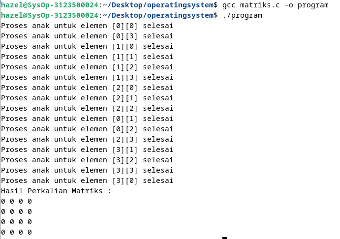

   <br>

analisa :
Progam tersebut untuk mengalika dua matriks 4x4
dengan menggunakan proses
anak untuk menghitung pada setiap elemen hal ini menggunakan
fungsi fork()


Visualisasi Program

```
Proses Induk
│
├─> Fork Proses Anak 1 (untuk elemen [0][0])
│   └─ Hitung elemen [0][0] --> Keluar
│
├─> Fork Proses Anak 2 (untuk elemen [0][1])
│   └─ Hitung elemen [0][1] --> Keluar
│
...
│
└─> Fork Proses Anak 16 (untuk elemen [3][3])
    └─ Hitung elemen [3][3] --> Keluar
```
