<div align="center">
  <h1 style="font-weight: bold"> Pemrograman SHELL Minggu 8</h1>
  <h4 style="text-align: center;">Dosen Pengampu : Dr. Ferry Astika Saputra, S.T., M.Sc.</h4>
</div>
<br />
<br />
<div align="center">
  
  <h3 style="text-align: center;">Disusun Oleh : </h3>
  <p style="tex-align: center;">
    Hazel Mangadaralam Pratama Rayes (3123500024)<br>
  </p>
  <h3 style="text-align: center;line-height: 1.5">Program Studi Teknik Informatika<br>Departemen Teknik Informatika Dan Komputer<br>Politeknik Elektronika Negeri Surabaya<br>2023/2024</h3>
  <hr>
</div>

## Daftar isi


## Bash Programming 

### Apa itu bash?

Bash, kependekan dari Bourne Again Shell, adalah open source command line interpreter dan scripting language. Ini menafsirkan perintah yang dimasukkan pengguna, baik secara interaktif atau dari file skrip.

Ini berfungsi sebagai interface untuk memanggil perintah, memungkinkan system function calls.

Ada 2 tipe dari mode bash

- **Interactive Mode**
    Juga disebut sebagai command intepreter, memungkinkan eksekusi perintah di terminal. Ini mengeksekusi perintah secara berurutan jika ada beberapa perintah.

- **Non-interactive Mode**
    Ini merujuk pada scrpts, memungkinkan Anda menulis Bash syntax yang berisi rangkaian beberapa perintah untuk eksekusi skrip.

### Apa Perbedaan dari Bash dan Shell

Shell, an alias for Bourne Shell, adalah command-line interpreter untuk OS Unix dan Linux. Bash, alias Bourne Again Shell, adalah versi yang disempurnakan.

### Untuk apa skrip bash digunakan?

Skrip Bash memiliki banyak kasus penggunaan, termasuk:
- Menulis skrip untuk mengotomatiskan tugas pemrograman
- Menyinkronkan tugas untuk menyalin file
- Menjalankan tugas cron untuk penjadwalan

### Bagaimana cara menulis kode di bash?

Untuk menulis kode dalam skrip Bash, ikuti langkah-langkah berikut:
- Di terminal, buat file menggunakan `vi test.sh`.
- Tambahkan `#!/bin/bash` di bagian atas file.
- Tambahkan beberapa cuplikan kode shell.
- Simpan file shell dengan `.sh` ekstensi.
- Jalankan skrip shell menggunakan `./test.sh` perintah di terminal.

### Apakah bash termasuk bahasa pengkodean?

Bash menjalankan perintah dari terminal atau file. Ini adalah bahasa pemrograman yang beroperasi pada sistem operasi kernel Unix/Linux, berisi semua fitur untuk menulis kode lengkap.

Bash adalah tipe shell khusus yang menerima masukan dari perintah, menjalankan kode, dan memproses masukan, serta mengembalikan hasilnya.

### Jenis Shell

Ada berbagai jenis shell di OS Unix.

<table>
<thead>
<tr>
  <th style="background-color: blue; color: white">Tipe Cangkang</th>
  <th style="background-color: blue; color: white">Alias</th>
  <th style="background-color: blue; color: white">Garis Pertama</th>
<tr>
</thead>
<tbody>
  <tr>
  <td>SH</td>
  <td>Bourne Shell</td>
  <td>#!/bin/sh</td>
  </tr>
   <tr>
  <td>bash</td>
  <td>Bourne Again Shell</td>
  <td>#!/bin/bash</td>
  </tr>
   <tr>
  <td>cshell</td>
  <td>C shel</td>
  <td>#!/bin/csh</td>
  </tr>
</tbody>
</table>

| tcsh | TENEX C shell | #!/bin/tcsh | | | | ksh | Korn shell | #!/bin/ksh |

### Perbedaan dari Command Line dan Script di bash

Mari kita lihat perbedaan antara baris perintah dan skrip

Opsi baris perintah

- Baris perintah memiliki prompt yang menerima masukan dari pengguna
- Perintah tidak disimpan ke file.
- Ini hanya mendukung satu perintah pada satu waktu.

File skrip

- Mendukung banyak perintah dalam satu file
- Prompt masih dapat ditulis dalam file skrip
- Hanya satu baris dalam sebuah file yang dijalankan secara berurutan

## Bash - Variables

**Deklarasi Variable**: Untuk membuat variable, maka harus memberikan nilai padanya

``` 
variableName=VariableValue
```

Keterangan: 

- variableName: dapat berisi kombinasi huruf apa saja, angka, dan garis bawah
- variableValue: adalah nilai yang disimpan dalam variabel, dan dapat berupa angka, string atau boolean. Simbol `=` digunakan untuk memberikan nilai pada suatu variabel.

Misalnya

```
AGE=25
```

### Cara mengakses variabel di bash

  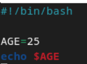

`Output` : 
    
  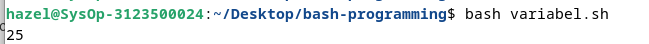

### Bash Shell readonly variables

  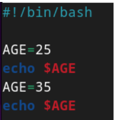

Setelah variabel diberi nilai, kita dapat mengubahnya ke nilai baru menggunakan operator penugasan =

  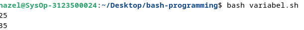

**Membuat Variable tidak dapat diperbarui**

  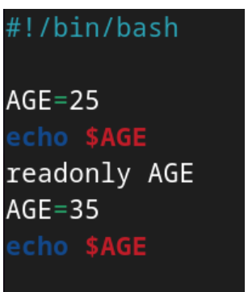

keyword `readonly` mencegah variable untuk diperbarui, secara efektif mengubahnya menjadi `constant`.

  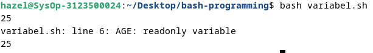

### Bash Unset Variable

Keyword `unset` membantu menghilangkan nilai dari variable yang ditentukan. Variable tetap dapat diakses tetapi mencetak nilai kosong.

  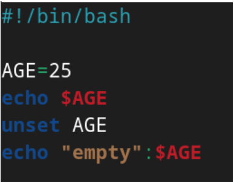

Output:

  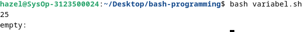

### Variables Scope

Setiap variabel yang dideklarasikan harus memiliki ruang lingkup, yang menentukan di mana variabel tersebut dapat digunakan dalam program.

Misalnya, jika suatu variabel dideklarasikan di dalam suatu fungsi, maka variabel tersebut hanya tersedia di dalam fungsi tersebut dan tidak dapat diakses di luar fungsi tersebut.

Cakupan variabel di Bash dapat didefinisikan dengan dua cara

- Variabel global
- Variabel lokal

### Variable Global Bash

### Bash Local Bash

### Variables Typing

### Display Environment 

### Variable nameing covention

### Shell variables

## Bash - Loop File

Terkadang kita ingin membaca konten file menggunakan bash programming. 
Ada berbagai macam cara yang dapat kita lakukan

### Bagaimana cara membaca file demi baris di bash Shell?
- menggunakan perulangan while

  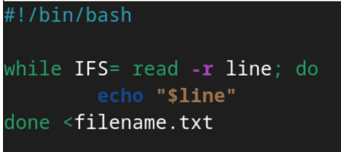

  Output

  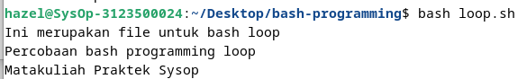

<br>
Output diatas merupakan isi dari file `filename.txt` 

## Bash - Comments

Posting ini menjelaskan cara menulis komentar dalam skrip bash shell, dengan contoh yang menyertainya.

`Comments` adalah pernyataan kode yang berisi teks yang dapat dibaca pengguna yang dilewati shell selama eksekusi. Setiap bahasa pemrograman menyertakan fitur komentar, yang memberikan deskripsi baris kode atau pernyataan.

Komentar sebaris dalam kode membantu pengembang dalam mengedit dan memahami kode dengan lebih baik.

Bahasa script bash memungkinkan anda menggunakan jenis komentar berikut.

- **Komentar tunggal**
- **Komentar multi-baris**

Komentar berguna bagi manusia, kode ditulis untuk scripting

### Komentar satu baris di bash shell 

Komentar satu baris dalam skrip shell dilambangkan dengan `#` simbol di awal setiap baris.

Komentar ini mencakup string yang memberikan informasi tentang baris kode terkait dalam skrip shell.

Penting untuk menempatkan komentar satu baris pada baris terpisah untuk kejelasan.

Untuk komentar sebaris, gunakan simbol `#` di awal komentar. Komentar satu baris selalu dimulai dengan `#` simbol.

**Syntax:**

```
# Single-line comments
```

Spasi kosong setelah `#` simbol tidak diperlukan. Berikut ini adalah contoh komentar satu baris dalam skrip shell.

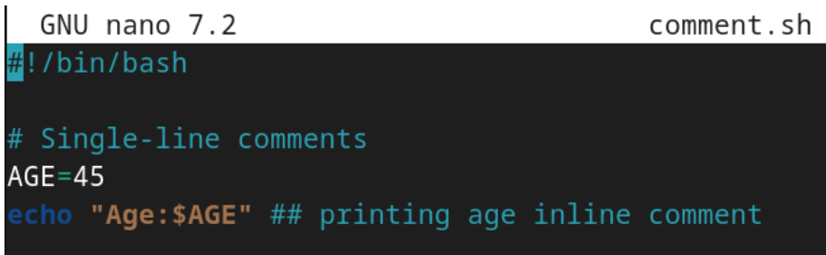

Output


### Komentar multi-baris dalam skrip shell

Komentar multi-baris melibatkan penggunaan lebih dari satu baris untuk komentar.

Cara pertama untuk membuat komentar multi-baris adalah dengan memanfaatkan komentar satu baris yang setiap barisnya dimulai dengan simbol komentar satu baris.

Cara kedua untuk membuat komentar multi-baris adalah dengan mengapit beberapa baris di dalam (`:`) dan (`'`).

Sintaks ini melibatkan:

- Komentar dimulai dengan titik dua (`:`) diikuti dengan `'`.
- Ini diikuti oleh beberapa baris komentar.
- Komentar diakhiri dengan `'`. Berikut sintaksnya:

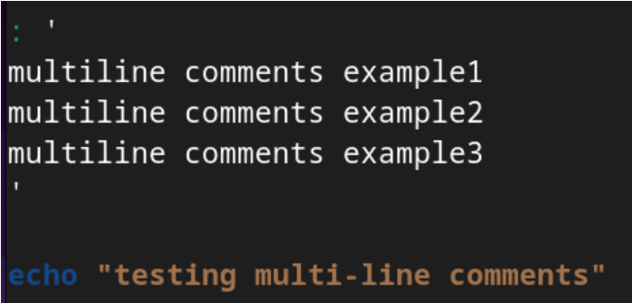

Output:

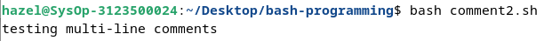

Hal ini berguna untuk memasukkan lebih banyak teks yang mencakup beberapa baris, juga melayani tujuan dokumentasi.

### Kesimpulan
Singkatnya, kita telah mempelajari cara menambahkan komentar tunggal dan multi-baris dalam pemrograman skrip shell.

## Bash - Arrays

Array di shells adalah variable untuk menyimpan lebih dari satu nilai/data.
Misal ketika memiliki data daftar bilangan integer 1-100, dan ingin menyimpan bilangan-bilangan ini di shell script, tanpa array kita harus mendeklarasikannya satu persatu / baris per baris menggunakan `let number1=1` dst. Jadi, anda bisa menggunakan array yang merujuk ke satu variabel dan menyimpannya.

### Bagaimana cara mendeklarasikan dan membuat array?

Ada 2 jenis array yang dapat kita buat
- array yang diindeks: elemen array disimpan dengan indeks mulai dari nol
- array terkait: array disimpan dengan pasangan nilai kunci

**Deklarasi sebuah array**

Untuk membuat array, kita perlu mendeklarasikan array.
```
declares -a array; # indexed array
declare -A array; # associative array
```
Sebuah array dideklarasikan dengan kata kunci declaredengan opsi `-a` atau `A`

**Menetapkan nilai tanpa mendeklarasikan Array**

```
arrayvariable[index]=value
```
Artinya, `arrayvariable[indeks]` array dideklarasikan dan diberi nilai.

Array diindeks nol berdasarkan nol pada panjang array -1 indeks=0 - mengembalikan elemen pertama indeks=-1 mengembalikan elemen terakhir

Array bisa berisi angka, string, dan campurannya. Mari kita buat contoh array.

### Akses nilai Array

Array berisi indeks untuk mendapatkan elemen. Elemen array dapat diakses menggunakan sintaks di bawah ini.

```
${array_name[index]}
```

### Deklarasi Array angka dan Loop

Array dapat berisi angka Contoh ini berisi array angka dan loop for untuk dicetak

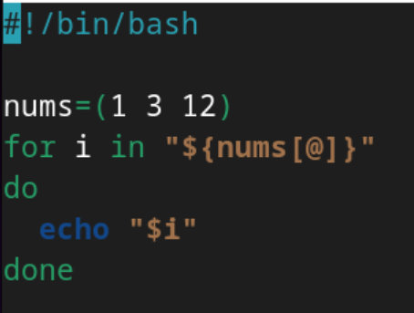

Output:

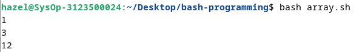


## Deklarasi Array string dan Loop

Array dapat berisi angka Contoh ini berisi array angka dan loop for untuk dicetak

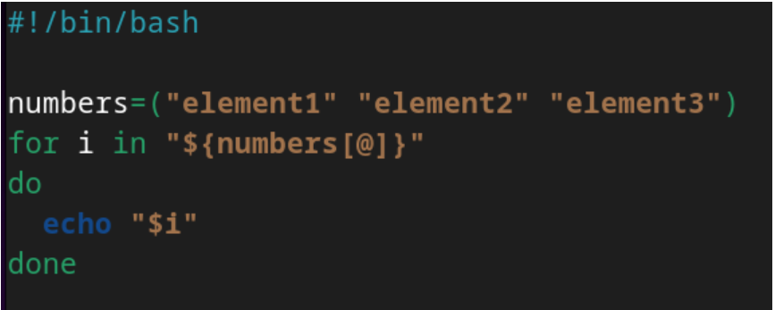

Output

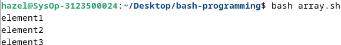

## Akses elemen pertama array

Dalam elemen Array, indeks elemen Pertama adalah nol, dan array[0] mengembalikan elemen pertama

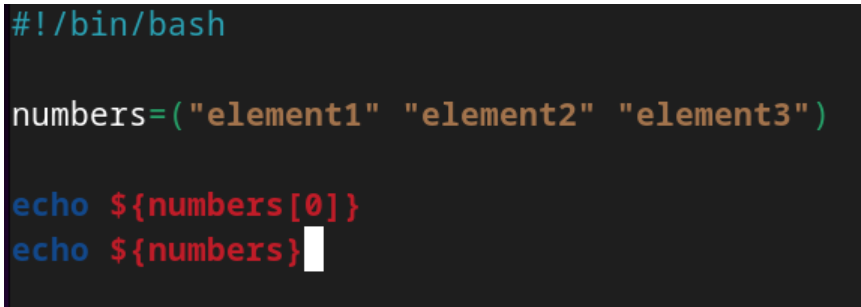

Output

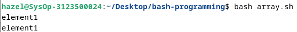

## Dapatkan element terakhir dalam sebuah array

Dalam skrip bash, Anda dapat menggunakan indeks=-1 untuk mendapatkan elemen array terakhir.

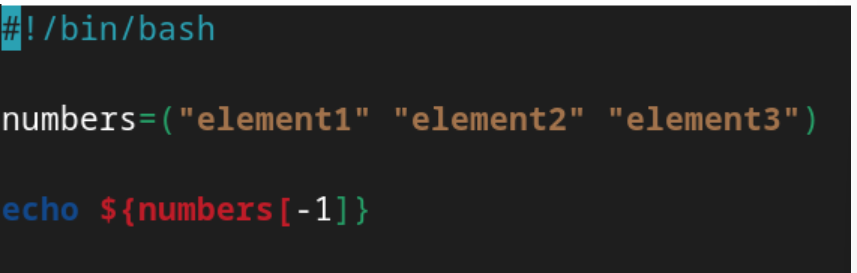

Output

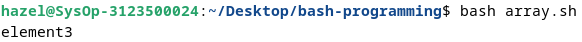

## Iterate atau Loop element array

For loop digunakan untuk mengulangi elemen.

Berikut adalah contoh contoh loop array untuk mencetak semua elemen

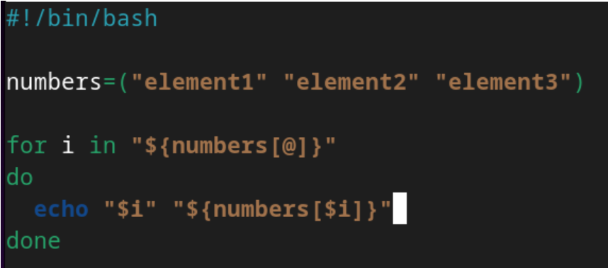

Output

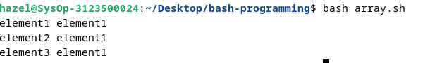

## Cetak semua elemen array

Gunakan [@] atau [*] untuk mencetak semua elemen array.

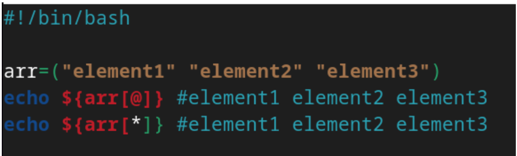

Output

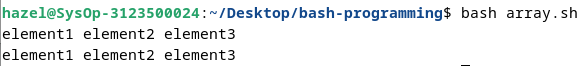

## Hapus elemen dari array

Anda dapat menghapus elemen dari array menggunakan unset indeks tertentu.

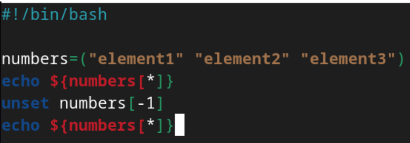

Output

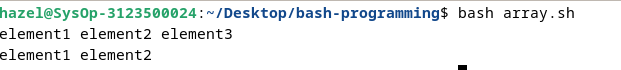

## Menambahkan elemen ke array

Anda dapat menambahkan elemen di posisi indeks mana pun menggunakan sintaksis di bawah ini.

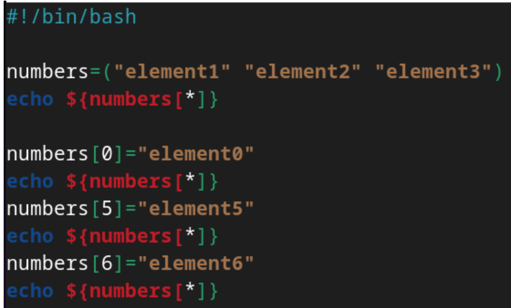

Output

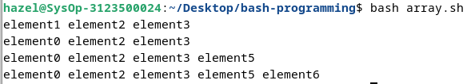

## Panjang sebuah array

Dalam hal ini, Temukan jumlah semua elemen dalam array.

Script Shell menyediakan `#`

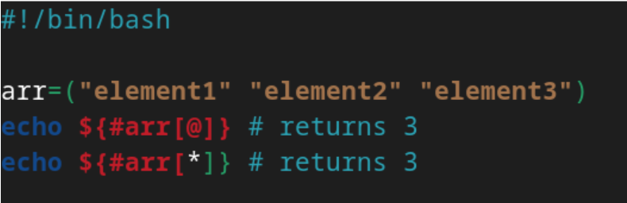

Output

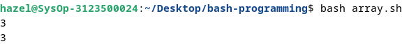

### Array cheat sheet

<table>
<thead>
<tr>
  <th style="background-color: blue; color: white">Example</th>
  <th style="background-color: blue; color: white">Description</th>
<tr>
</thead>
<tbody>
    <tr>
        <td>Sdeclare -a array	</td>
        <td>Declare an Indexed array</td>
    </tr>
    <tr>
        <td>declare -A array	</td>
        <td>Declare an Associative array</td>
    </tr>
    <tr>
        <td>declare -a array=()	</td>
        <td>Declare an indexed array with empty array</td>
    </tr>
    <tr>
        <td>array=()</td>
        <td>create an empty array with declaring is valid</td>
    </tr>
    <tr>
        <td>array=(1 6 3)</td>
        <td>Initialize array with numbers</td>
    </tr>
    <tr>
        <td>array=(one two three)</td>
        <td>Initialize the array with string</td>
    </tr>
    <tr>
        <td>array=(one two 1)</td>
        <td>Initialize the array with mixed data</td>
    </tr>
    <tr>
        <td>${array[0]}</td>
        <td>Get first element</td>
    </tr>
    <tr>
        <td>${array[1]}</td>
        <td>Get second element</td>
    </tr>
    <tr>
        <td>${array[-1]}</td>
        <td>Get last element</td>
    </tr>
    <tr>
        <td>${array[@]}</td>
        <td>Get All element</td>
    </tr>
    <tr>
        <td>${array[*]}</td>
        <td>Get All element</td>
    </tr>
    <tr>
        <td>${!array[!]}</td>
        <td>Get All indexes</td>
    </tr>
    <tr>
        <td>${#array[!]}</td>
        <td>Array length</td>
    </tr>
    <tr>
        <td>array[0]=12</td>
        <td>Add element to array at first position.i.e index=0</td>
    </tr>
    <tr>
        <td>array[-1]=22</td>
        <td>Add element to array at last position.</td>
    </tr>
    <tr>
        <td>array+=(11)</td>
        <td>Append value to an array</td>
    </tr>
    <tr>
        <td>${array[@]:k:i}</td>
        <td>Get index=1 element starting from index=k</td>
    </tr>
</tbody>
</table>

## Bash - Expansion

Tutorial ini menjelaskan cara menulis skrip batch dalam skrip shell dan menjalankannya.

perintah dimasukkan ke OS untuk membuat panggilan sistem dan melakukan tindakan. perintah masukan pengguna di terminal untuk melakukan operasi seperti ls, cd, mkdir dll.

Cara lain, Beberapa perintah dapat ditempatkan dalam satu file, juru bahasa bash membaca perintah dan menjalankannya

Cara menulis skrip shell di bash

- Pilih Editor atau editor teks
- Buat file dengan ekstensi .sh atau .bash
- Tulis perintah dalam file
- Simpan file sebagai `hello.sh`


Output

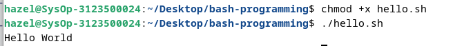

## Bash - Conditional Expression

Ekspresi kondisional dievaluasi pada waktu eksekusi skrip, berdasarkan hasil, Ia mengeksekusi blok perintah tertentu.

ini

Ada berbagai jenis ekspresi konisional di Bash

- Operator Perbandingan String
- Operator Perbandingan Numerik
- Operator File
- Operator Logis

### Operator File
Bash menyediakan operator logika pada FIle dan direktori untuk menguji ekspresi kondisional. Ini memungkinkan Anda untuk memeriksa berbagai operasi seperti keberadaan, dan izin, ukuran. Ini digunakan ekspresi kondisional dalam pernyataan kondisional seperti if else dan case.

Syntax:

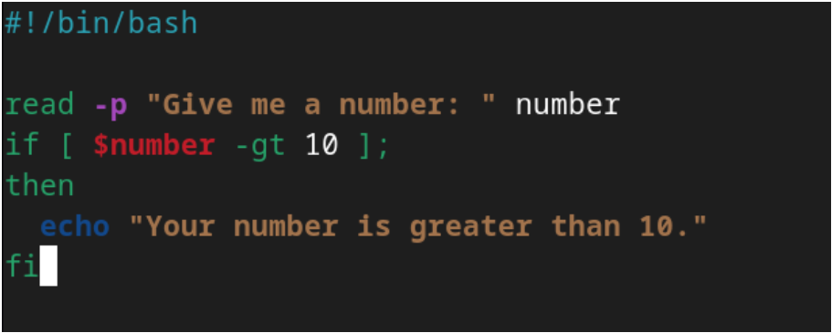

Output:

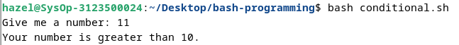

conditional_expressions berisi opsi, dan jalur file, yang selalu mengembalikan nilai benar atau salah.

berikut adalah opsi yang disediakan

<table>
<thead>
<tr>
  <th style="background-color: blue; color: white">Example</th>
  <th style="background-color: blue; color: white">Description</th>
<tr>
</thead>
<tbody>
    <tr>
        <td>-e file</td>
        <td>Returns true if given file exists, file can be normal file or directory</td>
    </tr>
    <tr>
        <td>-f file</td>
        <td>Returns true if given file exists and a file(not directory)<td>
    </tr>
    <tr>
        <td>-d file</td>
        <td>Returns true if file is an directory</td>
    </tr>
    <tr>
        <td>-r file</td>
        <td>Returns true if file exists and has readable permission</td>
    </tr>
    <tr>
        <td>-w file</td>
        <td>Returns true if given file exists, file can be normal file or directory</td>
    </tr>
    <tr>
        <td>-x file</td>
        <td>Returns true if file exists and has writable permission</td>
    </tr>
    <tr>
        <td>-s file</td>
        <td>Returns true if file exists and size is not empty</td>
    </tr>
    <tr>
        <td>-G file</td>
        <td>Returns true if file exists and isowned by a Group ID that matches</td>
    </tr>
    <tr>
        <td>-O file</td>
        <td>Returns true if file exists and owned by a user ID that matches</td>
    </tr>
    <tr>
        <td>-N file</td>
        <td>Returns true if file exists and modified by last read date</td>
    </tr>
    <tr>
        <td>-L file</td>
        <td>Returns true if file exists and and is an symbolic Link</td>
    </tr>
    <tr>
        <td>file1 -ot file2</td>
        <td>Returns true if file1 is older than file2 or file2 exists, file1 does not exist</td>
    </tr>
    <tr>
        <td>file1 -ne file2</td>
        <td>Returns true if file1 is newer than file2,file1 exists, file2 does not exists</td>
    </tr>
    <tr>
        <td>file1 -ef file2</td>
        <td>Returns true if file1 and file2 pointed to same device and inode</td>
    </tr>
</tbody>
</table>

## Bash - Case Statements

pernyataan case mirip dengan switch case dalam bahasa pemrograman lain.

Ini digunakan untuk membandingkan masukan yang diberikan dengan beberapa pola, dan perintah di dalam pola yang cocok dijalankan.

Syntax:

```
case expression in

pattern1)
  ## Commands
  ;;
pattern1)
  ## Commands
  ;;
*)
  ## Default case to execute if none of the pattern is matched
  ;;
```

- expression adalah variabel atau expression yang valid untuk dievaluasi
- Ini berisi pola defiend di dalam case yang dievaluasi dengan membandingkan expression, mencocokkan case fuound, mengeksekusi perintah di dalamnya.
- case default ( `*)`) untuk dijalankan jika tidak ada pola yang cocok
- Setiap blok pola diakhiri dengan `;;`
`case` adalah kata awal dan `esac` merupakan kata yang mengakhiri pernyataan kasus

Contohnya sebagai berikut:

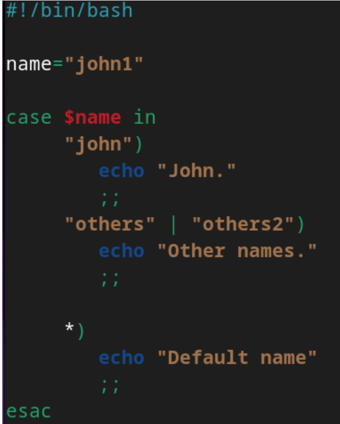

Output:

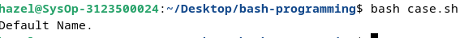

## Bash - Special Characters

Karakter khusus di bash dievaluasi dengan arti khusus dalam interpretasi suatu perintah. Karakter-karakter ini memiliki instruksi khusus, penggunaan karakter ini memiliki arti berbeda dalam konteks berbeda
**Blankspace(" "):**
Ini juga disebut spasi putih, berisi tab, spasi, kembali, baris baru. Ini memberitahu penerjemah bash untuk memisahkan perintah dan konten. Ini adalah pembatas untuk memisahkan perintah dan string.

Syntax :

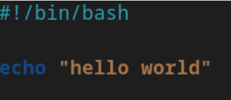

Output:

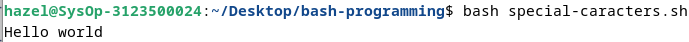

Contoh di atas, echo adalah perintah yang diikuti spasi, dan string berisi spasi untuk kata.

**Expansion($)**

Simbol tanda dolar digunakan untuk berbagai jenis perluasan parameter perluasan, ($variabel, ${variabel}) Substitusi ($(ekspresi)) ekspresi artema ($((ekspresi)))

**Ambersand(&)**

Menambahkan & di akhir perintah memungkinkan Anda menjalankan perintah di latar belakang.

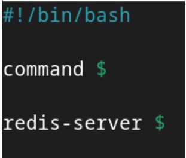

**Single quotes**

Single quotes (') are used to define a string without a special meaning. It means all the variables and expansion are not interepreted and print the same literal string

Syntax :

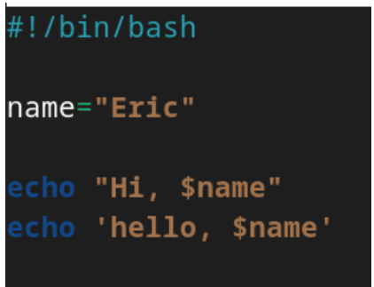

Output :

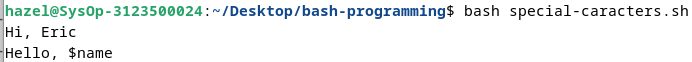

Jika kutipan tunggal berisi kutipan tunggal bersarang, Anda harus menghindarinya menggunakan ```.

Syntax :

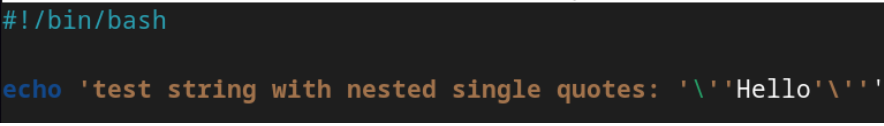

Output :

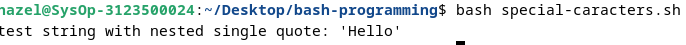

**Double qoutes**

Tanda kutip ganda (') digunakan untuk mendefinisikan string literal dengan arti khusus.

jika string berisi variabel dan sintaks perluasan, Ini diinterprestasikan dan diperluas, dengan nilai yang dievaluasi saat runtime.

jika string tidak ingin memperluas variabelnya, maka Anda dapat keluar dari \ sebelum simbol $ dolar

Syntax :

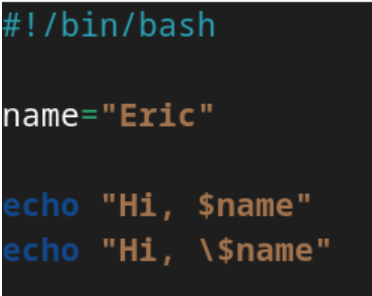

Output :

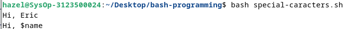

**Backslash Character( \ )**

Karakter garis miring terbalik digunakan untuk keluar dari karakter dalam string. ini digunakan dalam string yang dikutip ganda.

Syntax :

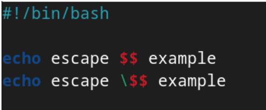

Output :

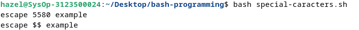

**Comment ( # )**

Simbol komentar digunakan untuk mengomentari sebaris kode. Baris komentar selalu dimulai dengan #.
Itu diabaikan oleh penerjemah bash.

Syntax :

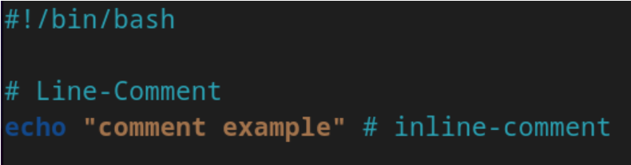

Output :

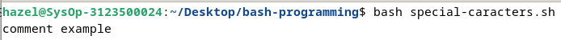


## Bash - if elif else

### Conditional Statement Bash Shell

Terkadang, Anda mungkin perlu mengeksekusi beragam blok kode bergantung pada berbagai keputusan berdasarkan kondisi tertentu.

Skrip Bash memfasilitasi hal ini melalui pernyataan kondisional

```
  if condition; then
     # true code
  elif another_condition; then
     # condition is false, and another_condition is true
  else
     # none of the above conditions are true
  fi
```

- Pernyataan tersebut `if` digunakan untuk mengeksekusi blok kode jika suatu kondisi benar, dengan syntax `if then fi`.
- Pernyataan ini `else` digunakan untuk mengeksekusi kode jika suatu kondisi salah, mengikuti syntax `if then else fi`.
- Pernyataan ini `if..elif..else` berguna ketika Anda perlu mengeksekusi kode jika tidak ada kondisi sebelumnya yang benar. Syntaxnya adalah sebagai berikut:

Catatan:

- Kondisi adalah ekspresi yang mengevaluasi `true` atau `false` dalam skrip shell.
- Spasi diperlukan sebelum dan sesudah [ dan ].
- Diperlukan titik koma sebelum itu.
- `if`, `else`, `then`, `elif`, `fi` adalah kata-kata khusus di Bash.
- Kondisi adalah ekspresi dengan perintah.
    - Perintah yang berisi sintaks tanda kurung tunggal, contoh sintaksis `[expression]` dan digunakan untuk operasi string file.
    - Sintaks tanda kurung ganda, contohnya adalah `[[expression]]`, yang digunakan untuk menggabungkan beberapa kondisi dan menangani pola regex.
    - Tanda kurung ganda, contoh sintaksnya adalah `((expression))`, digunakan untuk operasi aritmatika

### If Conditional Statements

Pernyataan `if` di Bash digunakan untuk mengeksekusi blok kode ketika kondisi tertentu adalah `true`.

```
if [ condition ]; then
   # Execute code block if the condition is true
fi
```

Dalam sintaks di atas:

- Ganti `[ condition ]` dengan ekspresi kondisional.
- Blok kode dalam pernyataan `if` dieksekusi hanya jika kondisi yang ditentukan bernilai benar.
- Setiap `if` pernyataan harus diakhiri dengan `fi`.

Contoh

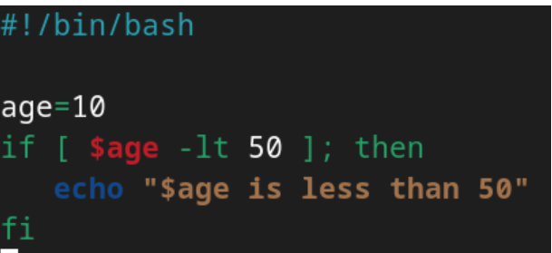

Output:


### If-else Conditional Statements

Pernyataan `if-else` kondisional di Bash memungkinkan Anda untuk mengeksekusi blok kode yang berbeda tergantung pada apakah suatu kondisi `true` atau `false`.

```
if [ condition ]; then
   # Execute code block if the condition is true
else
   # Execute code block if the condition is false
fi
```

Dalam sintaks di atas:

- Ganti `[ condition ]` dengan ekspresi yang akan diuji.
- Blok kode dalam `if` pernyataan dijalankan jika kondisi yang ditentukan adalah `true`.
- Blok kode dalam `else` pernyataan dijalankan jika kondisinya adalah `false`.
- Setiap pernyataan `if-else` harus diakhiri dengan `fi`.


Output:


Dalam contoh ini, jika usianya lebih dari 60 tahun, maka akan dihasilkan “Warga Negara Lanjut Usia”; jika tidak, akan ditampilkan “Bukan Warga Negara Lanjut Usia”.

### If..elif..else Statements

Gunakan `if..elif..else` pernyataan kondisional di Bash untuk mengeksekusi blok kode berbeda berdasarkan beberapa kondisi.

```
if [ condition1 ]; then
	# Execute code if condition1 is true
elif [ condition2 ]; then
	# Execute code if condition1 is false and condition2 is true
else
	# Execute code if both condition1 and condition2 are false
fi
```

- Blok kode dalam `if` pernyataan pertama dijalankan jika `condition1` is `true`.
- Blok kode dalam `elif` pernyataan pertama dijalankan jika `condition1` salah `false` dan `condition2` benar``.
- Blok `else` dijalankan jika keduanya `condition1` salah `condition2` salah.
- Setiap `if..elif..else` pernyataan harus diakhiri dengan `fi`.

Contoh:


Output


Dalam contoh ini, skrip memeriksa apakah usia lebih besar dari 60, kurang dari 14, atau tidak termasuk dalam kategori apa pun, dan menampilkan pesan yang sesuai.

## Bash - Loops

Loop digunakan untuk mengeksekusi blok kode beberapa kali.

Misalkan Anda ingin menjalankan perintah berulang kali atau mencetak array.for loop digunakan di Bash

Berbagai jenis loop

Bash Script menyediakan berbagai jenis loop

- for loop
- for index loop
- while loop
- until loop

### For loop

for loop digunakan untuk mengeksekusi kode beberapa kali berdasarkan suatu kondisi atau element

Syntax:

```
for element in [list]
do
 ## Code block
done
```

Contoh:


Output:


### for loop index

for loop index mirip dengan bahasa C for loop index. Ini mengeksekusi kode beberapa kali berdasarkan kondisi benar, Ini dimulai dengan nilai awal dan iterasi berisi nilai yang akan bertambah 1.

```
for (( assignment; condition; iteration )); do
  # code block
done
```

Contoh


Output:


Ini mencetak angka 0 sampai 5. 

### while loop in bash

Perulangan `while` di Bash memungkinkan eksekusi kode berulang selama kondisi yang ditentukan adalah `true`. Jika kondisinya menjadi `false`, perulangan akan keluar.

Struktur dari while loop adalah sebagai berikut:

```
while [ condition ]; do
  # code block
done
```

Contoh:


Output:


While loop diatas mencetak bilangan 0-100, program berjalan selama kondisi `[[ i -lt 100 ]]` benar. Variabel `i` akan terus mengincrement 1 dan mencetak nilainya. Jika kondisi salah (mencapai 100), maka program akan selesai.

### Until loop in bash

Kata `until` kunci di Bash digunakan untuk mengeksekusi kode berulang kali hingga kondisi tertentu menjadi `true`, di mana loop keluar.

Struktur dasar dari perulangan sampai adalah sebagai berikut.

```
until [ condition ]; do
  # code block
done
```

`until` kata kunci digunakan di Bash dan diakhiri dengan `done`.

Contoh


Output:


Program ini berjalan sama dengan program yang ada pada *while loop* hanya saja ini menggunakan *until loop*. Variable `i` akan mengincrement 1 sampai 99 dan mencetak nilainya. Program akan berjalan selama kondisi `[[ i -eq 100 ]]` benar. Jika kondisi salah (mencapai 100) maka program akan berhenti.

## Bash - Append String

### Bash Arthematic expressions
Arthematic expressions digunakan untuk melakukan operasi matematika

ekspresi adalah istilah yang digunakan dalam matematika untuk menunjukkan suatu operasi. Ini berisi operan dan operator untuk melakukan operasi matematika. `a<b`adalah sebuah ekspresi. Ini mungkin berisi operator biner atau unary

Di bash, Expressions dibuat menggunakan `(())` tanda kurung dengan operan dan operator sebagai argumen. `((a ))` adalah ekspresi bash. Expressions adalah operasi matematika, dapat berisi sub ekspresi yang dipisahkan dengan koma.

Contoh 


Output:


Arthematic expressions dibuat menggunakan operator dibawah ini 
- Operator Aritmatik
- Operator Perbandingan
- Operator Logis 
- Operator Bersyarat

Operator perbandingan digunakan untuk mengecek satu sama lain dengan membandingkan nilai operator (<, <=, >, >=, ==, !=)

Contoh:


Output:


### Bash Arithmetic Expansion

Expansion sama dengan Expression, yaitu digunakan untuk menghitung nilai expression dan hasilnya diganti dengan nilai dan selalu diawali dengan tanda dolar. 

```
$((expression))
``` 

Contoh menghitung nilai rata-rata menggunakan expansion. Setelah perhitungan dilakukan, output diganti dengan ekspresi.


Output


### Kapan Menggunakan Expression dan Expansion Aritmatik

[[]] digunakan untuk menguji ekspresi, mengembalikan nilai boolean (1 atau 0). Ini akan digunakan dalam kasus berikut

- Gunakan ekspresi artetik
    - Untuk melakukan operasi matematika dan perbandingan
- Gunakan ekspresi artetik [[]]
    - Perbandingan string dan angka
    - Periksa file atau direktori ada

## Bash - Function

Fungsi adalah kode yang dapat digunakan kembali dan dikelompokkan dalam satu nama.

Mendeklarasikan suatu fungsi Memanggil Fungsi Fungsi dengan argumen Cakupan variabel dalam Fungsi

### Bagaimana mendeklarasikan suatu fungsi dan memanggilnya

Definisi fungsi berisi beberapa baris kode yang akan dieksekusi.

Fungsi berisi nama fungsi yang diapit `{}`.

Ini dapat dideklarasikan dengan 2 cara


dan keduanya memiliki output yang sama yaitu


### Cara meneruskan parameter ke suatu fungsi

```
function_name "parameter1" "parameter2" "parameter3".. "parametern"
```
Parameter dapat diakses menggunakan $1 $2 $3.. $n

Contoh


Output


## Bash - Append String

### Simple Variable Append

Mulailah dengan mendeklarasikan dua variabel string dalam skrip Bash, yang dapat dicetak ke konsol menggunakan echo dengan mengapit variabel dalam tanda kutip ganda.


Output:


Juga dapat menambahkan tanpa tanda kutip ganda


Output:


Contoh lain melibatkan penggabungan string ke variabel yang sama dan mencetaknya ke konsol:


Output:


Pendekatan ini memiliki pro dan kontra

- Sederhana dan mudah untuk menambahkan string.
- Jika Anda menambahkan beberapa variabel, keterbacaannya akan berkurang.
- Memahami sintaksisnya mungkin awalnya sulit bagi pengguna Bash baru.

### Gunakan Shorthand Arithmetic Operator

Operator aritmatika singkat (`+=`) biasanya digunakan dalam aritmatika untuk menambahkan nilai ke suatu variabel. Ini juga dapat digunakan untuk string untuk menambahkan string ke variabel.

Misalnya.

- `a+=1` setara dengan `a=a+1` dalam hal angka.
- `str+="test"` akan menjadi `str=str+"test"` dalam kasus string.

Berikut adalah contoh kode


Output:


Catatan:

- Mudah untuk menambahkan string dan mudah dibaca, karena operator aritmatika ada di setiap bahasa.
- Tidak disarankan dan tidak efisien untuk string yang lebih besar.

### Gunakan perintah printf

`printf` digunakan untuk memformat string dengan berbagai opsi pemformatan yang kompleks. Kita dapat menggunakan `printf` perintah untuk menggabungkan string. Formatnya adalah `%s%s`, menambahkan dua variabel string.


Output:


Catatan: Tidak mudah untuk memahami printf dengan opsi yang diformat

- Tidak mudah dipahami dengan opsi berformat printf.
- Tidak direkomendasikan dan tidak efisien untuk penambahan string.
- Kurang mudah dibaca oleh pengembang.

### Menggunakan here string

`Here strings` adalah sintaks khusus untuk meneruskan string ke perintah dalam skrip Bash. Mereka digunakan untuk meneruskan string input tanpa menggunakan sumber lain, seperti file. Ini memungkinkan meneruskan string ke perintah Bash apa pun dari file atau baris perintah.

Syntax:
```
command <<< string 
```

command: valid command <<<: adalah here string operator

string adalah string masukan

Contoh:


Output:


Dalam contoh ini, string kedua ditambahkan ke string pertama menggunakan operator string di sini.

Catatan:

- Cara lain untuk menambahkan string dengan sederhana.
- Pendekatan ini berguna untuk meneruskan string ke perintah dari file atau baris perintah saja, meskipun berfungsi untuk menambahkan string, namun kurang mudah dibaca.

### Kesimpulan

Dalam tutorial ini, Anda telah mempelajari cara menggabungkan variabel string dengan berbagai cara.

- Penambahan variabel sederhana dan operator aritmatika (`+=`) digunakan untuk penggabungan string yang dasar dan mudah.
- Jika Anda memerlukan pemrosesan string yang lebih kompleks bersamaan dengan penggabungan, `printf` disarankan.

## Bash - Operator

Apa itu operator?

Operator adalah simbol dalam pemrograman yang melakukan operasi pada operan

Syntax

```
operand1 operator operand2
```
Ada dua jenis operator.

- Operator Biner: Ini beroperasi pada dua operan seperti penjumlahan, pengurangan, perkalian, pembagian, dan modulus
- operator unary: Ini beroperasi pada operan tunggal seperti kenaikan dan penurunan

### Operator Bash Aritmatika

Operator aritmatika di Bash menyediakan operasi aritmatika seperti operator penjumlahan, pembagian, pengurangan, dan perkalian pembagian.

| Operator | Judul        | Keterangan                                 | Contoh               |
|----------|--------------|--------------------------------------------|----------------------|
| +        | Tambahan     | penambahan dua atau lebih operan          | p + q = 50           |
| -        | Pengurangan  | pengurangan dua atau lebih operan         | q - p = 10           |
| *        | Perkalian    | perkalian dua atau lebih operan           | p * q = 600          |
| /        | Membagi      | hasil bagi setelah pembagian nilai         | q / p = 1.5          |
| %        | Modulus      | kembalikan sisanya setelah pembagian nilai| q % p = 10           |
| -expr    | Minus Unary  | kebalikan dari suatu ekspresi             | -(10 - 7) adalah -3  |
| ~/       | Divisi Int   | mengembalikan nilai int pembagian         | (10 ~/ 7) adalah 1   |
| ++       | Kenaikan     | Tambahkan nilainya sebesar 1              | ++p = 21             |
| --       | Pengurangan  | Kurangi nilainya sebesar 1                | --q = 29             |

Berikut adalah contoh operator aritmatika

### Operator Penugasan

Operator penugasan digunakan untuk menetapkan nilai ke suatu variabel. Operasi dasarnya sama dengan (=)

Selain itu, Ada operator penugasan lainnya.

misalnya, p adalah 20

| Operasi          | Simbol | Keterangan                                 | Hasil                         |
|------------------|--------|--------------------------------------------|-------------------------------|
| Tambahkan Tugas  | +=     | Penambahan dan penugasan ke variabel       | ((p += 3)) adalah 23          |
| Kurangi Tugas    | -=     | Kurangi dan tugaskan ke variabel           | ((p -= 3)) adalah 17          |
| Perkalian Tugas  | *=     | Perkalian dan penugasan ke variabel        | ((p *= 2)) adalah 40          |
| Penugasan Divisi| /=     | Penambahan dan penugasan ke variabel       | ((p /= 5)) adalah 4           |

### Operator Bitwise

| Operasi               | Simbol | Keterangan                                          | Hasil                            |
|-----------------------|--------|-----------------------------------------------------|----------------------------------|
| DAN                   | &      | Bitwise AND dari dua operan                        | $op1 & $op2 adalah 0             |
| DAN Setara            | &=     | Bitwise DAN Sama dengan dua operan                | $op1 & $op2 adalah 0             |
| ATAU                  | \|     | Bitwise OR dari dua operan                         | $op1 \| $op2 adalah 7            |
| XOR                   | ^      | XOR bitwise dari dua operan                        | $op1 ^ $op2 adalah 7             |
| Pergeseran Kiri       | <<     | Pergeseran Kiri Bitwise dari dua operan           | $op1 & $op2 adalah 0             |
| Persamaan Pergeseran Kiri | <<=  | Pergeseran Kiri Bitwise Sama dengan dua operan    | $op1 \| $op2 adalah 7            |
| XOR                   | ^      | XOR bitwise dari dua operan                        | $op1 ^ $op2 adalah 7             |
| XOR Setara            | ^=     | Bitwise XOR Sama dengan dua operan                | $op1 ^ $op2 adalah 7             |

### Operator Logika

Operator ini digunakan untuk melakukan operasi logika pada variabel/ekspresi/data.

| Operasi       | Simbol | Keterangan                                                           | Hasil                         |
|---------------|--------|----------------------------------------------------------------------|-------------------------------|
| Logis DAN     | &&     | Kembalikan nilai benar (status keluar = 0) jika kedua operan benar, jika tidak, kembalikan salah (status keluar bukan nol) | $op1 &&& $op2 adalah 0        |
| Logis ATAU    | \|\|   | Logis OR dari dua operan                                            | $op1 & $op2 adalah 0          |
| Logis TIDAK   | \!     | Balikkan nilai bersyarat.                                           | $op1 s 7                      |

### Operator Perbandingan String

| Operasi    | Keterangan                                                         |
|------------|--------------------------------------------------------------------|
| -z Tali    | Kembalikan nilai benar jika string kosong, jika tidak salah.       |
| -n Tali    | KEMBALI benar, Jika string tidak kosong.                          |
| str1=str2  | kembalikan nilai true, jika str1 dan str2 sama.                    |
| str1!=str2 | mengembalikan nilai true, jika str1 dan str2 tidak sama.           |
| str1>str2  | kembali benar, jika str1 mengurutkan sebelum str2.                |
| str1<str2  | kembali benar, jika str1 mengurutkan setelah str2.                |

### Numerical Comparision Operator

Berikut ini adalah operator Perbandingan.

menggunakan operator `-eq` dalam `if fi` pernyataan kondisional


Output:


Output diatas failed dikarenakan nilai dari variable first dan second memang tidak sama atau tidak equal.


| Operation  | Nama              | Deskripsi                                                  |
|------------|-------------------|------------------------------------------------------------|
| -eq        | Equal             | Memeriksa apakah dua variabel sama                         |
| -ne        | Not Equal         | Memeriksa apakah dua variabel tidak sama                   |
| -lt        | Less Than         | Memeriksa apakah variabel pertama lebih kecil dari variabel kedua |
| -le        | Less Than or Equal| Memeriksa apakah variabel pertama kurang dari sama dengan variabel kedua |
| -gt        | Greater Than      | Memeriksa apakah variabel pertama lebih besar dari variabel kedua |
| -ge        | Greater Than or Equal | Memeriksa apakah variabel pertama lebih besar dari sama dengan variabel kedua |

Berikut Contohnya:


Output


### Other Operators

| Operasi | Deskripsi                                                         |
|---------|-------------------------------------------------------------------|
| -v      | Mengembalikan nilai benar jika sebuah variabel ditetapkan nilai, artinya nilai telah diassign |
| -o      | Mengembalikan nilai benar jika sebuah opsi shell (optname) diaktifkan |
| -R      | Mengembalikan nilai benar jika sebuah variabel ditetapkan nilai, dan itu adalah referensi bernama |

## Bash - Number Comparison

### Cara memeriksa apakah 2 angka sama atau tidak di bash

Kode gagal:


Kode sukses:


Output gagal:


Output sukses:


Beberapa skrip shell tidak mendukung (()), gunakan [[]] dengan operator Perbandingan

Berikut ini adalah operator Perbandingan.

- `-eq`: setara
    - Periksa apakah dua variabel sama

- `-ne`: Tidak sama
    - Periksa apakah dua variabel tidak sama

- `-lt`: Kurang dari
    - Periksa apakah variabel pertama lebih kecil dari variabel kedua

- `-le`: Kurang dari sama
    - Periksa apakah variabel pertama kurang dari sama dengan variabel kedua

- `-gt`: Lebih besar dari
    - Periksa apakah variabel pertama lebih besar dari variabel kedua

- `-ge`: Lebih besar dari atau sama dengan
    - Bandingkan Periksa apakah variabel pertama lebih besar dari sama dengan variabel kedua

menggunakan operator `-eq` dalam `if fi` pernyataan kondisional


## Bash - Check Directory

### Script Bash Periksa apakah direktori tersebut ada

Pada contoh di bawah, `if` blok digunakan untuk menguji ekspresi kondisional untuk keberadaan direktori.

**Periksa apakah Direktori Ada dan Cetak Pesan**

Ekspresi kondisional menggunakan `-d` opsi untuk memeriksa apakah direktori tersebut ada.

**periksa direktori yang ada dan cetak pesannya.** Ekspresi kondisional berisi `-d` opsi dan jalur direktori. `-d` opsi yang memeriksa apakah direktori ada atau tidak.

Ini sebuah contoh


Output:


Harap dicatat bahwa tambahkan spasi setelah `[` dan sebelum `-d`.

**Bagaimana cara mkdir hanya jika direktori belum ada?**

Dalam contoh ini, menggunakan blok kondisional if-else.

- Diperiksa apakah direktori tersebut ada menggunakan -d.
- else blok akan memiliki kode untuk tidak ada dan membuat direktori menggunakan jalur direktori


**Periksa keberadaan direktori menggunakan sintaks ternary**

Alternatifnya, ekspresi kondisional ternary digunakan sebagai pengganti ekspresi kondisional if.

Berikut adalah contoh ekspresi kondisional


 
Output:


**Periksa apakah ada banyak direktori** Terkadang, Kami ingin memeriksa apakah ada banyak direktori.

Kita harus menggunakan pernyataan kondisional if dengan operator logika AND(&&).


Output:


**Periksa apakah direktori ada dan dapat ditulis serta dieksekusi**

Dalam contoh ini, Kode memeriksa hal-hal di bawah ini

- foldernya ada atau tidak
- jika ada, Folder tersebut memiliki izin untuk menulis dan dieksekusi.
- Terakhir, Cetak pesan string


Output:


**Periksa file atau direktori yang ada**

Terkadang, kami ingin memeriksa apakah file atau direktori tersebut ada. Opsi -e memeriksa file atau direktori untuk jalur yang diberikan ada atau tidak.


Output:


## Bash - File Name

### Ekstrak nama file dengan ekstensi

Untuk mendapatkan nama file beserta ekstensinya, basename perintah dapat digunakan untuk menghapus direktori dan hanya mengembalikan nama filename untuk jalur tertentu, baik itu a variable atau string.

Misalnya, jika jalurnya adalah /home/john/run.sh, nama file yang dikembalikan adalah run.sh. Proses ini melibatkan pengambilan jalur lengkap dan mengekstraksi hanya filename dengan menghapus jalur. Hasilnya filename kemudian disimpan dalam variabel dan dicetak ke konsol.
 
nama dasar digunakan untuk menghapus direktori dan mengembalikan nama file untuk jalur yang diberikan. jalurnya adalah variabel atau string. Misalnya, jalurnya adalah /home/john/run.sh, dan nama file yang dikembalikan adalah. run.sh Dalam hal ini, jalur lengkap diberikan dan mengembalikan nama file dengan menghapus jalurnya.

Sebagai contoh menggunakan kode yang sudah dimodifikasi sebagai berikut:


Output:


### Ekstrak nama file tanpa ekstensi

Untuk mendapatkan hanya nama file tanpa ekstensi, Anda dapat menggunakan sintaksis `${filename%.*}`.

Misalnya, pertimbangkan jalur /home/john/run.sh yang akan menjadi nama file yang dihasilkan run.sh.

Awalnya, basename perintah ini digunakan untuk menghilangkan direktori dan menghasilkan nama file untuk jalur yang ditentukan dan mengembalikan variabel, dan variabel ini kemudian digunakan bersama dengan sintaks ekspresi untuk menghapus ekstensi dari nama file.

Ekspresi ini secara efektif menghapus ekstensi dari nama file.


Output:


### Ekstrak ekstensi untuk jalur file

Untuk mengisolasi ekstensi file dari jalur file yang diberikan, `${filename##*.}` dapat dimanfaatkan. Ekspresi ini hanya mengembalikan ekstensi file.

Misalnya, pertimbangkan jalur /home/john/run.sh yang akan menjadi ekstensi yang dihasilkan sh.

Awalnya, basename perintah ini digunakan untuk menghapus jalur direktori dan mengembalikan nama file untuk jalur yang ditentukan, dan nama file ini kemudian digunakan bersama dengan sintaks ekspresi untuk mengembalikan ekstensi saja.


Output:


Berikut adalah contoh komprehensif yang menunjukkan cara mendapatkan nama file dengan atau tanpa ekstensi file. Setelah menjalankan skrip di bawah ini, skrip tersebut akan dicetak

- file dengan ekstensi,
- hanya nama file tanpa ekstensi,
- dan ekstensinya saja.


Output


### Kesimpulan

Skrip ini menunjukkan berbagai pendekatan untuk menangani nama file dan ekstensi di lingkungan Bash.

## Bash - Split String

Dalam beberapa kasus, saat bekerja dengan skrip bash, timbul kebutuhan untuk memisahkan string berdasarkan pembatas dan mengekstrak beberapa string untuk diproses lebih lanjut atau disimpan dalam variabel.

Tutorial ini memandu Anda melalui pemisahan string dengan contoh dalam pemrograman bash shell.

Artikel ini membahas tiga metode.

- Pisahkan string menggunakan perintah awk
- Gunakan variabel IFS
- Ekspansi Parameter dengan for loop

### Pisahkan string menggunakan perintah awk dalam skrip bash shell

Perintah tersebut awk, sebuah utilitas Linux yang kompatibel dengan semua distribusi bash dan shell, digunakan untuk membagi string berdasarkan delimiter.

Input diberikan menggunakan simbol pipa (|), dan contoh di bawah ini menunjukkan pemisahan string yang mengandung titik dua ( :)


Output:


### dibagi menggunakan variabel IFS

Di sini, string masukan terdiri dari elemen yang dipisahkan oleh hyphens. Variabel shell IFS(Pemisah Bidang Internal) diatur ke tanda hubung, dan string diiterasi menggunakan perulangan for.

Setiap elemen dicetak setelah tanda hubung dihilangkan.


Output:


### Gunakan ekspansi Parameter dan loop

Perluasan parameter digunakan untuk mengubah nilai variabel berdasarkan opsi yang ditentukan. Dalam hal ini, variabel string diubah menjadi array. Array kemudian diiterasi menggunakan sintaks for loop, mencetak setiap elemen ke konsol:


Output:


Berbagai cara untuk menangani manipulasi string, memungkinkan Anda memilih metode yang sesuai dengan kebutuhan Anda.

## Bash - String Length

Panjang string ditentukan oleh jumlah karakter yang dikandungnya, dan umumnya mudah untuk memastikan panjangnya untuk teks normal.

Postingan kali ini akan membahas berbagai metode untuk menghitung jumlah karakter dalam sebuah string dengan pengkodean UTF.

Menggunakan Sintaks ${#variable}

Metode pertama melibatkan penggunaan `${#variable}` sintaksis untuk mendapatkan panjang variabel string.

Dalam hal ini, jumlah karakter dalam variabel string.


Output:


Menggunakan Perintah wc -m

Metode kedua melibatkan penggunaan perintah wc -m, baik secara langsung dengan string atau melalui variabel.


Dalam contoh ini, `echo -n "string"` digunakan untuk mencetak string tanpa baris baru ( `-n option`). Operator `|` pipa mengarahkan output dari perintah sisi kiri ke perintah sisi kanan, dan `wc -m` menghitung jumlah karakter dalam sebuah string.

Output:


Menggunakan `expr` Perintah Metode lain melibatkan penggunaan `expr` perintah untuk mencari panjang string.


Output:


Di sini, `${}` mewakili substitusi ekspresi, mensubstitusi nilai ekspresi ke dalam string. `expr` mengeksekusi `expressions`, dan `length` merupakan argumen yang diteruskan `expr` untuk menemukan panjang string.

`$(expr length "$msg")` mengembalikan jumlah karakter dalam string, ditetapkan ke variabel, nilai variabel dicetak ke konsol

- menggunakan perintah awk `Awk` menyediakan cara lain untuk menghitung panjang string menggunakan ekspresi.


Output:


Dalam hal ini, `echo -n "$variable"` keluaran string tanpa baris baru, dan keluaran disalurkan `awk` menggunakan simbol pipa( `|`). Perintah `awk '{print length}'` menghitung dan mencetak panjang baris input.

Dengan menggabungkan metode di atas dalam sebuah ekspresi `${}`, Anda bisa mendapatkan panjang string.

### Kesimpulan

Posting ini telah membahas berbagai cara untuk menentukan panjang string di Bash. Pilihan pendekatan dapat bergantung pada preferensi Anda.

## Bash - bashrc

File .bashrc adalah file skrip bash yang dijalankan dalam kasus berikut

- menggunakan eksekusi skrip bash
- bash shell dibuka dan dimulai secara interaktif

File ini disembunyikan secara default karena file dimulai dengan . disembunyikan.


File .bashrc adalah skrip yang dijalankan saat pengguna login. File ini terletak di direktori home pengguna. Berisi environment variables dan user preferences untuk dikonfigurasi di dalam file ini

Untuk membaca / melihat file bashrc, kita bisa menggunakan Vi atau nano editor dengan command `nano ~/.bashrc`

file bashrc terletak di dua tempat

- direktori home pengguna
- Direktori sistem

Dalam kasus direktori home pengguna, file ini disembunyikan secara default. Lokasinya adalah `~/.bashrc` tempat ~ pengguna saat ini login di direktori home.

Dalam hal direktori Sistem, file ini terletak di `/etc/bash.bashrc`.

### Bagaimana cara memuat ulang pengaturan .bashrc tanpa keluar dan masuk kembali?

jika Anda membuat perubahan apa pun pada file .bashrc, Perubahan tidak akan langsung terlihat. Anda harus menutup dan memulai kembali sesi bash untuk melakukan perubahan.

Bagaimana cara memuat ulang konfigurasi .bashrc tanpa login lagi? Jalankan perintah berikut di command prompt.


## Bash - Ternary Operator

Pemrograman Bash tidak memiliki dukungan untuk sintaks operator ternary.

Operator ternary ditulis dalam bahasa Java

```
expression?value1:value2
```

Sintaksnya mirip dengan ekspresi kondisional if dan else. jika ekspresi benar, nilai1 dikembalikan, jika tidak, nilai2 dikembalikan.

### Cara menggunakan operator ternary di bash

Cara pertama, gunakan if-else dengan expression syntax.


Output:


Cara kedua, gunakan arithmetic expression menggunakan && dan || Syntaxnya adalah


Output:


Ada cara lain untuk menetapkan variabel, bukan ekspresi.

dengan menggunakan mari kita dapat menetapkan variabel berdasarkan hasil ekspresi kondisi


Output


## Bash - Lowercase

Tutorial ini menjelaskan cara mengonversi string menjadi huruf kecil dalam skrip Bash.

Misalnya, jika string inputnya adalah “Selamat Datang Halo Dunia”, outputnya akan menjadi “selamat datang di dunia”.

Ada beberapa cara untuk mencapai hal ini, bergantung pada jenis dan versi Bash.

- **menggunakan perintah tr**

Perintah tr, kependekan dari translator, adalah perintah Unix yang digunakan untuk mengonversi karakter dari satu format ke format lainnya.

Sintaksnya adalah sebagai berikut:

berikut adalah syntaxnya.

```
tr input_format output_format
```

Contoh:


Output:


bisa juga menggunakan:


Output:


Catatan: `tr` berfungsi dengan `ASCII` dan tidak mendukung UTF karakter.

- **menggunakan perintah awk**

Untuk mengubah string menjadi huruf kecil menggunakan perintah `awk`, `tolower` fungsinya digabungkan dengan `awk`.

Hasilnya kemudian diteruskan ke perintah echo menggunakan operator pipa:


Output:


Metode ini paling baik untuk karakter ASCII dan UTF.

- **Gunakan Perl di Bash Script Printing lc dengan Perl mengubah string menjadi huruf kecil.**

lc adalah alias untuk huruf kecil.


Output:


- **gunakan ekspansi Parameter Bash 4.0 memperkenalkan utilitas manipulasi string bawaan. Untuk mengonversi string menjadi huruf kecil, cukup tambahkan dua `commas` ke string. Ini juga disebut sintaks perluasan parameter.**

Sintaksnya adalah `${variable[options]}`.

Contoh:


Output:


Atau


Output:


Di sini, `${msg,,}` gunakan `,,` opsi untuk mengonversi variabel menjadi huruf kecil.

Perhatikan bahwa ini berfungsi di Bash versi 4.0 dan lebih tinggi.


## Bash - Uppercase

Tutorial ini memandu Anda melalui proses mengonversi string ke uppercaseskrip bash dan shell.

String huruf besar mengacu pada string yang berisi semua huruf dalam huruf besar.

Misalnya, jika string inputnya adalah “Selamat Datang Halo Dunia”, outputnya akan menjadi “SELAMAT DATANG DUNIA”.

Bergantung pada jenis dan versi bash, ada beberapa metode untuk mengonversi string menjadi huruf besar.

- **menggunakan perintah tr**

Perintah tr, kependekan dari translator, adalah perintah Unix yang digunakan untuk mengonversi karakter dari satu format ke format lainnya.

Sintaksnya adalah sebagai berikut:

berikut adalah syntaxnya.

```
tr input_format output_format
```

Contoh: 


Output:


Alternatif lain:


Output:


Catatan: `tr` berfungsi dengan `ASCII` dan tidak mendukung UTF karakter.

- **menggunakan perintah awk**

Untuk mengubah string menjadi huruf besar menggunakan perintah `awk`, `toupper` fungsinya digabungkan dengan awk. Hasilnya kemudian diteruskan ke perintah echo menggunakan operator pipa:


Output:


Yang terbaik adalah bekerja dengan ASCII dan UTF karakter.

= **dalam versi bash 4.0 bash 4.0menyediakan utilitas manipulasi string bawaan. Menambahkan dua tanda sirkumfleks (^) ke sebuah string akan membuat string menjadi string huruf besar.**


Output:


- **menggunakan Perl dalam skrip bash**

`print uc` perintah di Perl mengubah string menjadi huruf besar


Output:


- **Gunakan sintaks perluasan parameter Bash 4.0 menyediakan utilitas manipulasi string bawaan. Menambahkan dua tanda sirkumfleks (^) ke sebuah string menjadikannya string huruf besar, juga disebut sintaks perluasan parameter.**

Sintaksnya adalah `${variable[options]}`


Output:


Sintaks perluasan parameter mengubah string menjadi huruf besar. `${message^^}` berisi `^^` opsi untuk mengubah string pesan variabel menjadi huruf besar.

Fitur ini tersedia di Bash versi 4.0 ke atas.

## Bash - Substring

### Menggunakan Operator Perbandingan untuk Memeriksa Substring ada atau tidak

- Tentukan variabel string yang berisi teks.
- Gunakan pernyataan if untuk membandingkan string dengan substring yang diinginkan menggunakan operator kesetaraan ( ==) dan wildcard (*).
- Terakhir, cetak string jika substring ditemukan.


Output:


### Gunakan Ekspresi Reguler untuk Menemukan Substring

Operator `=~` memfasilitasi pencarian substring dalam string tertentu, digunakan dalam blok if.


Output:


### Gunakan perintah grep

Perintah grep digunakan untuk mencari string tertentu, disalurkan ke string utama untuk perbandingan.


Output:


Metode ini menawarkan pendekatan berbeda untuk memeriksa apakah suatu string berisi substring tertentu, sehingga memberikan fleksibilitas untuk kasus penggunaan yang berbeda.

## Bash - Variable Set

Tutorial ini tentang memeriksa variabel dalam pemrograman skrip bash shell

- Periksa variabel disetel atau tidak
- variabel kosong atau tidak kosong
- Periksa variabel apakah string kosong atau tidak

Berikut beberapa contoh penggunaan variabel untuk variabel `price`

Berikut adalah tabel untuk deklarasi variabel beserta keterangannya:

| Deklarasi variabel  | Keterangan                                                            |
|----------------------|-----------------------------------------------------------------------|
| price;               | Variabel tidak dideklarasikan dan tidak disetel                        |
| price=;              | Variabel dideklarasikan dan tidak disetel                              |
| price=3000;          | Variabel dideklarasikan, ditetapkan, dan tidak disetel                 |
| price=(3000);        | Variabel dideklarasikan, ditetapkan, dan tidak disetel                 |
| price tidak ditetapkan; | Variabel tidak dideklarasikan dan tidak disetel                       |

Semoga tabel ini bermanfaat! Jika ada yang perlu diperbaiki atau ditambahkan, beri tahu saya.

### Bagaimana cara memeriksa apakah suatu variabel diatur dalam skrip bash?

Misalnya variabelnya diset artinya,

- Itu dideklarasikan dan ditetapkan dengan kosong atau tidak kosong.

Dalam contoh di bawah ini,

- `variable1` dideklarasikan tetapi kosong
- `variable2` tidak dideklarasikan dan tidak disetel.


Output:


Cara lain untuk memeriksa suatu variabel adalah dengan menyetel menggunakan -v opsi


Output:


### Bagaimana cara memeriksa apakah variabel tidak disetel di skrip bash?

Misalnya variabelnya tidak disetel artinya

- Itu tidak ada dan tidak diumumkan.

Dalam contoh di bawah ini,

- variable1 dideklarasikan tetapi kosong
- variable2 tidak dideklarasikan dan tidak disetel.


Output:


### Cara mengecek variabel kosong atau tidak kosong

Tutorial ini memeriksa pemeriksaan variabel dibandingkan dengan spasi dan membungkus ekspresi ini di dalam [[]].


Output:


Hal yang sama juga dapat ditulis menggunakan variabel dalam tanda kutip ganda yang dibungkus dalam tanda kurung tunggal [].


Output:


Mari kita periksa juga untuk tidak mengosongkan menggunakan ! operator.

Berikut adalah kode untuk `example checks if a variable is non-empty`.

SATU ARAH,


Output:


Cara lain:


Output


Opsi penggunaan -z lainnya untuk memeriksa variabel disetel dan kosong atau tidak kosong menggunakan kode di bawah ini


Output:


## Bash - Iterate Nos

Tutorial ini membahas berbagai cara untuk mengulangi rentang angka yang disimpan dalam variabel dan mencetaknya ke konsol.

Dalam contoh ini, Hasilkan urutan rentang angka dan simpan dalam variabel.

Terkadang, Kami ingin membuat nama file dengan nama yang berisi angka yang dihasilkan dari urutan atau rentang angka.

### Hasilkan serangkaian angka dalam skrip bash

**menggunakan alat seq seq menghasilkan urutan angka.**


Output:


**menggunakan perulangan for**


Output:


**while loop**


Output:


### Kesimpulan

`seq` lebih baik dibandingkan dengan loop for dan while


