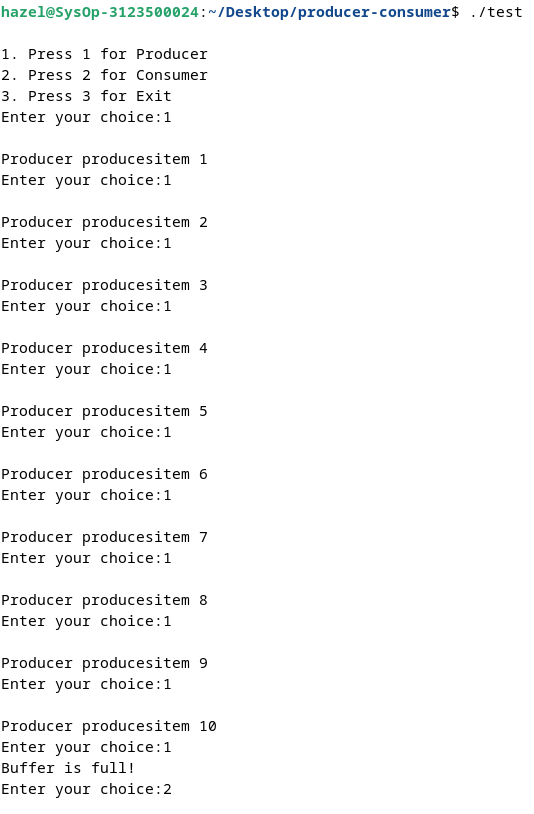
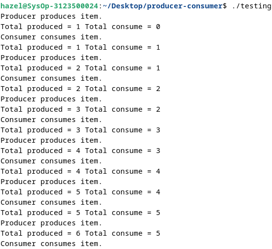

  <h1 style="font-weight: bold">Producer Consumer  Minggu 9</h1>
  <h4 style="text-align: center;">Dosen Pengampu : Dr. Ferry Astika Saputra, S.T., M.Sc.</h4>

 
 

  
  <h3 style="text-align: center;">Disusun Oleh : </h3>
  

    Hazel Mangadaralam Pratama Rayes (3123500024) 
  

  <h3 style="text-align: center;line-height: 1.5">Program Studi Teknik Informatika Departemen Teknik Informatika Dan Komputer Politeknik Elektronika Negeri Surabaya 2023/2024</h3>
  

## Producer Consumer Semaphore

  
  
   

Analisa : 
Program diatas contoh implementasi dari Producer Consumer Semaphore problem dalam bahasa C. Dalam kasus ini, menu yang terdapat dalam program terdapat 3 menu, yaitu pertama Producer, kedua Consumer, dan ketiga Exit. Menu pertama Producer adalah untuk membuat data dengan maximal data sebanyak 3, jika user memilih opsi 1 berturut-turut sampai lebih dari 10 kali maka akan mencetak pesan "Buffer is full!!" yang mengartikan bahwa storage buffer sudah penuh. Begitu juga sebaliknya jika user memilih menu kedua secara berturut-turu sampai lebih dari 10 kali, maka akan mencetak pesan "Buffer is empty!!" yang menandakan bahwa buffer sudah kosong/tidak ada isinya. Menu ketiga untuk keluar dari program.

## Producer Consumer Wake-Sleep thread

  

   

  Analisa :

  Program ini adalah implementasi produsen-konsumen menggunakan thread dan semaphore dalam bahasa C++. Ada dua thread yang berjalan secara bersamaan: produsen dan konsumen. Produsen terus menghasilkan item, sementara konsumen mengonsumsi item yang dihasilkan. Semaphore `notEmpty` digunakan untuk sinkronisasi antara keduanya. Setiap kali produsen menghasilkan item, dia memberi tahu konsumen dengan `sem_post(&notEmpty)`, dan konsumen menunggu hingga ada item yang tersedia dengan `sem_wait(&notEmpty)`. Program berjalan dalam loop tak terbatas, dan terdapat sedikit penundaan acak antara setiap operasi produksi atau konsumsi.

### Referensi

- [Producer Consumer](https://www.geeksforgeeks.org/producer-consumer-problem-in-c/)

